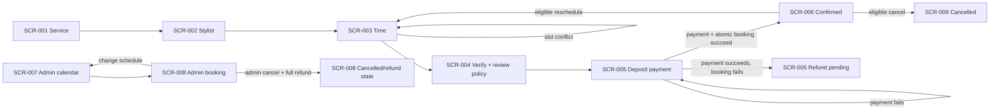

# Figma Make handoff — Neighborhood salon booking

Figma visualization: **NOT VERIFIED**  
Execution boundary: this package has not been submitted to or rendered by Figma Make.

## Authority and guardrails

- Sole product evidence: `evals/behavioral-v0.2/fixtures/figma-handoff/closed-definition.md`, approved definition revision 12.
- Build a mobile-first, low-fidelity responsive web prototype from 320px upward.
- Validate hierarchy, layout, content, interaction, navigation, state, and flow. Do not invent brand colors, imagery, decorative styling, animation, fields, roles, routes, policies, or branches.
- Non-goals: marketplace discovery, walk-ins, subscriptions, reviews.
- Roles: customer; shop admin; stylist availability only. Customer ownership is gated by verified mobile number.
- Preserve every `SCR-*` ID in page/frame names and annotations.

## File/page structure

1. `00_PRODUCT_MAP` — roles, scope/non-goals, route inventory, locked policy card.
2. `01_USER_FLOWS` — `FLOW-001` customer booking, `FLOW-002` customer management, `FLOW-003` admin management.
3. `02_WIREFRAMES` — default low-fi frames named exactly `SCR-001__DEFAULT` through `SCR-008__DEFAULT`.
4. `03_SCREEN_STATES` — only the listed state variants, named `SCR-###__STATE`.
5. `99_HANDOFF` — rules, data contract, acceptance checklist, responsive/accessibility checklist, and explicit out-of-scope list.

## Global interaction and content rules

- Customer stepper: Service → Stylist → Time → Verify & review → Payment → Confirmation. Back preserves valid upstream choices; changing service/stylist invalidates incompatible downstream time selection.
- One service and one stylist per booking. Shop timezone governs all displayed slots. Use a 30-minute grid; service duration visibly blocks consecutive slots.
- Slot display may be optimistic, but final reservation is atomic. A conflict sends the user back to time selection with refreshed availability and preserved upstream choices.
- Before payment, show the 20% deposit, free-cancellation deadline (24 hours before start), late-cancellation non-refund, and one-reschedule-before-deadline policy.
- Payment retry must be idempotent. Payment success followed by booking-creation failure shows automatic refund and `refund pending`; it must not silently retry or create a duplicate booking.
- Persist timestamps in UTC; display dates/times in shop timezone. Snapshot price and duration on the booking.
- Admin changes require actor/time/reason audit. Admin cancellation produces a full refund.
- Reminders are scheduled at 24 hours and 2 hours before start.
- A customer may view only their own booking after mobile verification.

## Frames and variants

### `SCR-001` — `/book/service` — Service selection

- Default: page title, single-select service cards/rows with name, duration, and price; one primary Continue action disabled until selection.
- Variants: `SCR-001__LOADING`, `SCR-001__EMPTY`, `SCR-001__ERROR`, `SCR-001__OFFLINE`.
- Empty/error/offline states include a retry; never fabricate services.

### `SCR-002` — `/book/stylist` — Stylist selection

- Show selected service summary and single-select eligible stylist list. Continue requires one stylist; Back returns to service.
- Variants: `SCR-002__LOADING`, `SCR-002__EMPTY`, `SCR-002__ERROR`, `SCR-002__OFFLINE`.
- Empty state explains no eligible stylist is available and offers Back to service.

### `SCR-003` — `/book/time` — Time selection

- Show shop timezone, selected service/stylist summary, keyboard-operable date/calendar control, and 30-minute available slots. Communicate service-duration blocking.
- Variants: `SCR-003__LOADING`, `SCR-003__EMPTY_AVAILABILITY`, `SCR-003__SLOT_CONFLICT`, `SCR-003__ERROR`, `SCR-003__OFFLINE`, `SCR-003__TIMEOUT`.
- Slot conflict message: another customer secured the slot; refresh availability, preserve service/stylist, clear only the rejected slot, and focus the refreshed slot list.

### `SCR-004` — `/book/review` — Contact verification and policy review

- Present selected service, stylist, local date/time, price, deposit amount, and policy. Collect/verify mobile number and require explicit policy acknowledgement before Continue.
- Variants: `SCR-004__SUBMITTING`, `SCR-004__ERROR`, `SCR-004__TIMEOUT`, `SCR-004__OFFLINE`.
- Preserve entered mobile number on recoverable failures; avoid exposing another customer's booking.

### `SCR-005` — `/book/payment` — Deposit payment

- Restate booking summary, total price, 20% deposit due now, cancellation/refund policy, and one primary Pay deposit action.
- Variants: `SCR-005__PAYMENT_PROCESSING`, `SCR-005__PAYMENT_FAILED`, `SCR-005__TIMEOUT`, `SCR-005__OFFLINE`, `SCR-005__REFUND_PENDING`.
- Disable repeat submit while processing. Failed payment offers safe retry. Refund pending explains that payment succeeded but booking creation did not, automatic refund has started, and no booking exists.

### `SCR-006` — `/booking/:id` — Confirmation and manage

- Confirmed view contains local date/time, service, stylist, price snapshot, deposit/payment status, policy, reminder timing, and booking identifier.
- Management exposes Reschedule and Cancel only when allowed. One completed reschedule removes further reschedule eligibility.
- Variants: `SCR-006__CONFIRMED`, `SCR-006__CANCELLATION_FORBIDDEN`, `SCR-006__CANCELLED`, `SCR-006__REFUND_PENDING`, `SCR-006__LOADING`, `SCR-006__PERMISSION_DENIED`, `SCR-006__UNAUTHENTICATED`, `SCR-006__OFFLINE`, `SCR-006__TIMEOUT`.
- Cancellation confirmation must state financial consequence before destructive confirmation.

### `SCR-007` — `/admin/calendar` — Admin calendar

- Show shop-timezone calendar, stylist availability, and bookings with non-color-only status labels. Keyboard users can traverse dates and bookings and open a booking.
- Variants: `SCR-007__LOADING`, `SCR-007__EMPTY`, `SCR-007__ERROR`, `SCR-007__OFFLINE`, `SCR-007__PERMISSION_DENIED`.

### `SCR-008` — `/admin/booking/:id` — Admin booking detail

- Show booking/customer summary, snapshots, status, payment/refund, and audit history. Actions: change schedule and cancel booking; both require a reason.
- Variants: `SCR-008__SUBMITTING`, `SCR-008__SLOT_CONFLICT`, `SCR-008__CANCELLED`, `SCR-008__REFUND_PENDING`, `SCR-008__ERROR`, `SCR-008__TIMEOUT`, `SCR-008__OFFLINE`, `SCR-008__PERMISSION_DENIED`.
- Admin cancellation confirmation states full refund. Success records actor/time/reason and surfaces refund state.

## Flow wiring

## Required failure/recovery annotations

For every displayed failure annotate trigger, detection, user message, preserved input/state, retry eligibility, cancel/back path, mutation/refund result, duplicate protection, and final state. Cover validation failure, permission denial, unauthenticated/session expiry, timeout, offline, dependency failure, duplicate submit/concurrent slot request, partial payment/booking success, stale slot conflict, and destructive cancellation.

## Responsive and accessibility acceptance

- At 320px, no horizontal scrolling for primary content/actions; keep the primary action reachable and summaries readable.
- Calendar and slot controls are keyboard operable with logical focus order and visible focus.
- Use semantic labels and accessible names. Status is never conveyed by color alone. Text/UI contrast meets WCAG AA.
- Error text identifies the problem and recovery action; focus moves to the error summary or changed availability when appropriate.

## Make completion checklist

- Exactly eight routes/screens; no extra feature or route.
- Customer and admin flows match the wiring above.
- Every listed variant is present and linked from its default frame.
- Policies, price/duration snapshots, timezone behavior, verification/ownership, audit, reminders, idempotency, and automatic-refund recovery remain unchanged.
- Acceptance checks: one concurrent winner; policy shown before payment; complete confirmation details; every failure has recovery; responsive/accessibility requirements represented.
- After Make generation, review for missing/extra screens, invented branches, state/rule/permission/data/navigation drift, scope expansion, and acceptance violations. That review has not yet occurred: **NOT VERIFIED**.
