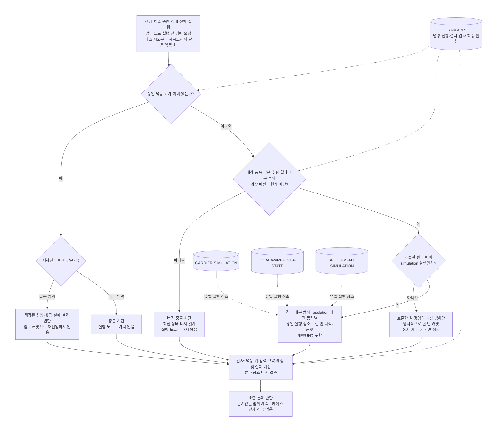
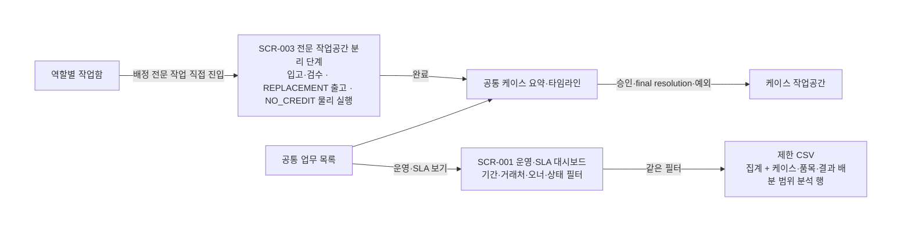

# 사용자 흐름 — B2B 반품·클레임 운영 웹앱

> `state.json` revision 79의 읽기용 투영본입니다. 권위 원천은 `state.json`입니다. 현재 상태는 `CLOSED`, `project.next_question`은 `null`이다. 중요 미결정 76개는 `ANSWERED` 74개, `DEFERRED_NON_BLOCKING` 1개, `OPEN` 0개, `SUPERSEDED` 1개이다. 결정 77개는 `ANSWERED` 76개·`SUPERSEDED` 1개, 규칙 77개는 `CURRENT` 76개·`SUPERSEDED` 1개이다. 제품 범위는 `COVERED` 136개, `N/A` 4개, `OPEN` 0개이고 UX coverage는 상태 셀 64/64, screen-axis cell 88/88, action cell 1012/1012로 완전하다. 사용자 승인 revision `79`, digest `1f329295fa2f11bda80709a63c5f6005d0bf47f9549b8978c712059230780a9a`은 `2026-08-26T18:34:49+09:00`에 기록됐고 구현·Figma·downstream은 시작하지 않았다.

초기 상태의 권위 경로는 `DEC-014 → STATE-001`과 `DEC-018 → STATE-002`다. 접수 채널·대리 등록 성공은 요청 접수 상태로, 정책 기준 안 품목·부분 수량은 현재 케이스 오너 결정 대기로 이어진다. 권위 그래프는 각각 결정의 `affects`와 상태의 `depends_on` 양쪽에 연결을 기록하며 기존 `DEC-013`·`DEC-015`·`DEC-016`, `STATE-006`·`STATE-007` 경계를 바꾸지 않는다.

## FLOW-001 — 반품·클레임 처리

- 전체 책임: `USR-003` 현재 케이스 오너인 권한 있는 RMA Agent. 권한 있는 RMA Agent 모두 조직 전체 케이스와 감사 이력을 조회할 수 있지만 결정·final resolution 최초 확정·재개·배정·면제·완료는 현재 오너만 수행한다. `DEC-034`~`DEC-037`에 따라 같은 Return Line의 final resolution 코드별 결과 배분·부분 수량은 독립 실행 범위다. 현재 오너는 각 범위를 `REFUND` 지급, `REPLACEMENT` 교환 출고, `RETURN_TO_CUSTOMER` 운송사 실물 인계 또는 거래처 직접 인수 서명, `NO_CREDIT` 폐기 실행 시작 전까지 사유를 필수로 남겨 다시 열 수 있다. 재개 대상 범위는 새 실행을 막은 채 미커밋 운송·정산 지시 취소·무효화, 재고·격리·금액 참조 재계산·재연결, 기존 통지의 `SUPERSEDED` 표시와 정정 통지 `PENDING`, 단계별 증거 확인을 순서대로 통과해야 새 resolution 버전을 활성화한다. 필수 정리가 실패하면 해당 범위만 `REOPEN_CLEANUP_HOLD`에 두고, 커밋된 범위와 다른 범위는 계속 처리한다. 같은 Return Line과 케이스에 커밋·미커밋·정리 보류 범위가 함께 존재할 수 있다. 기존 확정 기록은 삭제·덮어쓰지 않고 이전·새 범위 버전과 정리 증거를 잇는 감사 이벤트로 보존한다. `DEC-038`에 따라 실행 커밋 뒤 오류·분쟁은 원 resolution을 다시 열지 않고 해당 결과 배분·부분 수량 범위마다 별도 연결 정정 케이스를 만들며, 원 케이스·범위·resolution 버전·커밋 증거를 불변 참조한다. 현재 오너가 정정·보상 유형·사유·증빙을 결정하고 carrier·warehouse·settlement simulation이 보상 사건을 실행·기록하며 다른 범위와 원 케이스 완료는 계속한다. 오너 인계는 권한 있는 RMA Agent 사이에서 사유와 감사 이력을 남긴다. `DEC-046`에 따라 해당 케이스의 전체 내부 패키지는 현재 오너만 다운로드한다. `DEC-047`에 따라 현재 오너는 `NO_CREDIT` 보조 이메일 실패의 같은 참조 재전송과 에스컬레이션을 소유하되 성립한 통지와 물리 처리를 되돌리지 않는다. `DEC-048`에 따라 모든 `NO_CREDIT` 수량의 폐기 증거 또는 물리적 예외 해결을 확인한 뒤에만 케이스를 완료하며 폐기비 정산 예외·이의는 별도 연결 작업으로 계속 추적한다.
- 전문 수행: `USR-004`는 현재 오너가 배정한 입고·검수 작업, `DEC-074`의 `REPLACEMENT` 출고 작업, `DEC-051`의 `NO_CREDIT` 결과 배분·부분 수량별 물리 작업 및 필요한 문맥만 조회하고 해당 전문 필드만 변경한다. `REPLACEMENT` 출고에서는 대상 결과 배분·부분 수량·시리얼 또는 로트·새 추적값·재고 전후·불가역 효과·범위 버전을 확인하고, 상세 명시 확인 뒤 로컬 재고 차감과 carrier simulation 인계를 같은 유일 실행 참조로 수행·기록하되 final resolution이나 예외를 결정하지 않는다. 입고 검수에서는 `DEC-065`에 따라 품목·부분 수량별 포장 상태를 `INTACT` 또는 `DAMAGED_OR_OPENED`, 제품 상태를 `NORMAL` 또는 `DEFECT_CONFIRMED`, 재판매 가능성을 `YES` 또는 `NO`로만 기록하고, 단순 반품은 포장·외관·구성품, 불량은 신고 증상·기능 재현·외관·구성품, 오배송은 요청·승인 대비 실제 SKU·수량·추적값과 상품 라벨, 추적 불일치는 요청·승인 추적값과 실제 입고 추적값을 확인한다. 손상·불량·오배송·추적 불일치에는 `DEC-020`·`DEC-057`의 공통 증빙 기준을 적용한다. `NO_CREDIT` 작업에서는 판매 가능 재고 차단, 격리 위치 이동·관리, 폐기 인계·실행을 결정적 로컬 상태 저장소에 기록한다. 범위·부분 수량·시리얼 또는 로트, 전후 재고 상태·위치, 수행자·시각, JPG·PNG·PDF가 필수 증거이며 외부 폐기업체 사용 시 업체 식별자·인계 시각과 참조·처분 증명 참조를 추가한다. 현재 오너는 이 작업을 범위별로 배정하고 예외·완료·필수 증거를 검토·확정한다. 회수 운송장은 읽기 전용으로 입고에 연결하며 기준 필드는 변경하지 않는다. `USR-005`는 현재 오너가 배정한 `REFUND` 작업과 필요한 문맥만 조회하고 환불 전문 필드만 변경한다. 두 전문 역할은 전체 내부 패키지를 다운로드할 수 없고 배정 문맥 밖 일괄 다운로드를 할 수 없다. `SETTLEMENT SIMULATION`은 `REFUND`와 `NO_CREDIT` 요율 조회·금액 확정·실제 수량 조정·모의 차감·재차감·미수금 전환과 이의 금액 보류·사후 조정을 실행·기록하고, 현재 오너는 예외·재계산 통제·이의 검토·면제·완료와 자동 실패 작업을 소유한다. `DEC-031`에 따라 공급사 지정 택배 회수 운송장은 현재 케이스 오너가 등록·갱신하고 거래처 부담 발송 운송장은 거래처 사용자가 자기 조직 포털에서 등록·갱신하며 현재 오너가 두 방식의 누락·오류·예외를 감사형 정정한다. `DEC-030`에 따라 현재 케이스 오너가 outbound `RETURN_TO_CUSTOMER` 반환 운송장 생성·발송 인계·직접 인수 증거·추적 갱신을 직접 수행·기록하며 별도 실행 역할을 두지 않는다. 회수·교환 출고·반환 운송 이벤트는 `CARRIER SIMULATION`, 입고·검수·재고·격리·처분은 `LOCAL WAREHOUSE STATE`에 기록한다. `NO_CREDIT` 물리 실행은 `DEC-051`의 현재 오너 통제·배정 창고 담당자 실행·필수 증거·`LOCAL WAREHOUSE STATE` 또는 `SIMULATION` 경계를 따른다.
- `DEC-069` 창고 검수 기기·연결: 입고·검수, 배정된 `REPLACEMENT` 출고, 배정된 `NO_CREDIT` 물리 작업의 전체 편집은 휴대폰을 1순위로 하고 태블릿·데스크톱을 전체 기능 보조로 지원한다. 기기 로컬 초안·오프라인 편집·제출·동기화는 제공하지 않는다. 불안정 연결에서는 성공한 서버 체크포인트와 미저장 상태를 구분해 제출을 차단하고, 연결 복구 뒤 같은 멱등 키·품목·부분 수량 범위 버전으로 재시도한다. 전면 장애는 `DEC-056` 수기 대기열로 전환하며 기기 로컬 저장·오프라인 동기화·자동 병합은 추가하지 않는다.
- `DEC-066` 교환 실행 책임: 현재 케이스 오너가 `REPLACEMENT` 결과 배분·부분 수량 범위를 최초 확정하기 직전에 결정적 로컬 재고를 전량 원자 예약한다. 성공한 범위만 확정·출고 준비하고 SERIAL 또는 LOT 품목의 새 추적값을 기록해 출고 작업을 배정한다. 배정된 창고 담당자는 필요한 문맥과 새 추적값을 확인하고 결정적 로컬 재고의 출고 수량을 차감해 carrier simulation에 인계한다. 로컬 출고 차감과 carrier 운송 접수 성공이 같은 범위·resolution 버전·동작의 유일 실행 참조로 모두 기록된 때만 해당 범위를 교환 출고 커밋으로 잠근다. 예약 실패 범위는 확정하지 않으며 현재 오너만 수량 축소 또는 `REFUND` 재결정을 수행한다. 추가 재고 보충·부분 예약·실제 외부 연동은 이 흐름에 추가하지 않는다.
- `DEC-067` 환불 실행 책임: 현재 케이스 오너가 `REFUND` 결과 배분·부분 수량 범위를 배정하면 배정된 정산 담당자가 환불 금액과 결정적 로컬 거래처 정산 계좌 스냅샷을 확인해 이체를 요청한다. settlement simulation이 같은 범위·resolution 버전·동작의 유일 실행 참조로 `TRANSFER_ACCEPTED`를 기록한 때 지급 커밋으로 잠그고, 이어 같은 참조로 `TRANSFER_SETTLED`와 금액·`KRW`·계좌 스냅샷 참조·접수 시각·완료 시각·결과 참조를 기록한 때 실행 완료로 본다. `TRANSFER_ACCEPTED` 전 실패는 미커밋으로 유지해 `DEC-034`~`DEC-037`의 재개·정리를 적용하고, 그 뒤 오류·분쟁은 원 resolution을 다시 열지 않고 `DEC-038`의 범위별 연결 정정 케이스와 settlement compensation simulation으로 처리한다. 환불 금액 산식·실제 외부 계좌 또는 결제 연동·추가 정산 권한은 추가하지 않는다.
- `DEC-050` 배송 예외 책임: 운송사 실물 인계로 실행 커밋된 `RETURN_TO_CUSTOMER` 배송 범위가 분실·파손·배송 실패·미인수 예외가 되면 `DEC-038`의 범위별 연결 정정 케이스로 분리한다. 현재 오너가 carrier simulation 예외 증거를 검토해 운송사 클레임·추적 가능한 재발송·계속 보관·대체 처분 중 경로와 추가 비용 처리를 건별로 결정·기록하고, carrier simulation이 선택된 보상 사건을 실행·기록한다. 필수 증거가 갖춰지면 현재 오너가 연결 정정 케이스를 종결하고, 원 resolution은 다시 열지 않으며 다른 범위와 원 케이스 완료는 계속한다. 거래처 직접 인수 서명 전 미수신은 실행 커밋 전이므로 이 특칙에 합치지 않고 `DEC-035`의 미커밋 완료 차단 경계를 유지한다. 고정 우선순위·추가 비용 산식·필수 증거 스키마·재시도 정책·새 역할은 추가하지 않는다.
- `DEC-062` 착불 운송 책임: `RETURN_TO_CUSTOMER` 운송사 배송은 거래처 수취 착불로 주선한다. 현재 케이스 오너가 실물을 인계한 뒤 carrier simulation 운송 접수 성공과 함께 확정한 `KRW` 운임을 해당 결과 배분·부분 수량 범위에 고정한다. 라벨 값은 확정 금액이 아니며 거래처 포털에 확정 금액·착불 상태를 공개한다. 착불 회수 성공과 배송 완료는 하나의 성공 사건이고, 착불 회수 실패는 배송 완료로 기록하지 않은 채 `DEC-050`의 배송 실패·미인수 연결 정정 범위로 보낸다. 실제 외부 결제·청구 연동과 직접 인수 비용은 추가하지 않는다.
- `DEC-063` 반환 목적지 책임: 원 주문 납품처 주소와 수령 연락처를 `RETURN_TO_CUSTOMER` 운송사 배송의 기본값으로 자기 조직 거래처 포털에 제시한다. 거래처 사용자는 기본값을 확인하거나 대체 값을 요청하고, 현재 케이스 오너는 실물을 운송사에 인계하기 전에 요청을 검토해 사용할 목적지·연락처 스냅샷을 확정한다. 원 주문 fixture를 덮어쓰지 않고 원값·요청값·확정값·사유·수행자·시각을 감사 이력에 남긴다. 주소록·직접 인수 비용·실제 외부 주소 검증·라벨 연동은 추가하지 않는다.
- `DEC-064` 기존 건 경계: v1 dogfood는 RMA 앱에서 새로 생성한 케이스만 운영하며 기존 진행 중·완료 반품은 이 흐름에 진입시키지 않는다. 시나리오·성능 검증용 과거 형태 데이터는 결정적 로컬 fixture로 별도 생성하고 실제 이관 데이터로 표시하지 않는다. migration fixture·실제 이관·운영 전환 정책과 import 분기는 추가하지 않는다.
- `DEC-070` 운영·SLA 분석 흐름: 조직 전체 조회 권한이 있는 RMA Agent는 `SCR-001`에서 접수·완료·미완료 건수, 단계별 8업무시간 SLA 경고·초과, 요청 유형·사유·final resolution, 입고 불일치·물리·정산·연결 정정 예외를 기간·거래처·오너·상태로 필터링한다. 같은 필터의 집계와 케이스·품목·결과 배분 범위별 분석 행만 제한 CSV로 내보내고 실행을 감사한다. 증빙 파일·원문 감사 이벤트·연락처·정산 계좌는 제외하며, 이벤트 원장 탐색·대량 반출·JSON·추가 개인정보 필드·실제 외부 BI 목적지를 추가하지 않는다. 이 조회·내보내기는 현재 케이스 오너 전용 결정 권한을 늘리지 않으며 `DEC-046`의 오너 전용 건별 내부 케이스 패키지와 구분한다.
- `DEC-071` 불가역 실행 커밋 확인: `REFUND`의 `TRANSFER_ACCEPTED`, `REPLACEMENT`의 로컬 재고 출고 차감과 carrier 접수 성공, `RETURN_TO_CUSTOMER`의 운송사 실물 인계 또는 직접 인수 서명, `NO_CREDIT`의 폐기 실행 시작 직전에 대상 결과 배분·부분 수량, 시리얼 또는 로트, 불가역 효과, 역할별 핵심 정보와 현재 범위 버전을 표시한다. 현재 실행 권한이 있는 역할이 범위별 상세 명시 확인을 완료해야만 기존 멱등 키·예상 버전으로 커밋한다. 확인을 취소하면 커밋과 simulation 부수효과 없이 저장된 입력·서버 체크포인트를 유지하고 확인 결과·대상 범위·버전·수행자·시각을 감사한다. 새 승인 역할·2인 승인·실제 외부 실행은 추가하지 않는다.
- `DEC-072` draft 연결·복구: `SCR-002` 내부 대리 등록과 `SCR-004` 거래처 포털의 draft 작성·증빙 업로드·제출에서는 성공한 서버 저장만 권위 체크포인트로 둔다. 연결이 끊기거나 불안정하면 새 저장·제출을 차단하고 미전송 입력은 현재 열린 탭 메모리에만 유지하며 저장분과 미저장분을 구분해 표시한다. 재연결하면 같은 멱등 키·예상 범위 버전으로 다시 저장하고, 충돌하면 최신 서버 상태를 먼저 읽으며 자동 병합하지 않는다. 탭 종료·새로고침·세션 만료 뒤에는 마지막 서버 체크포인트에서 재개한다. 기기 영구 저장·오프라인 편집·오프라인 제출·동기화는 제공하지 않으며 `DEC-056` 전면 장애 수기 대기열과 `DEC-069`의 `SCR-003` 전용 계약은 유지한다.
- 조직 경계: `DEC-001`에 따라 한 도매·납품업체 조직 안에서만 운영하며 조직 전환이나 다중 고객 테넌트 분기는 없다.
- 진입: 거래처 사용자가 기본 채널인 포털에서 요청 draft를 만들거나, 전화·이메일 요청을 받은 내부 케이스 오너가 원 채널·요청자 정보를 남긴 대리 등록 draft를 만든다. `DEC-039`에 따라 제출 전에는 대상 품목·부분 수량·사유·증빙·추적값을 수정하거나 draft를 삭제할 수 있고, 제출 순간 원 요청 스냅샷을 불변으로 고정한다. 자동 유입은 현재 범위가 아니다.
- draft 연결·복구: `DEC-072`에 따라 성공한 서버 저장만 권위 체크포인트다. 연결 단절·불안정 중에는 새 저장·제출을 차단하고 현재 열린 탭의 미전송 입력만 임시 유지해 저장분과 구분한다. 재연결 시 같은 멱등 키·예상 범위 버전으로 다시 저장하며 충돌하면 최신 서버 상태를 먼저 읽고 자동 병합하지 않는다. 탭 종료·새로고침·세션 만료 뒤에는 마지막 서버 체크포인트에서 재개하고 기기 영구 저장·오프라인 편집·제출·동기화는 제공하지 않는다.
- 운영 데이터 진입: `DEC-064`에 따라 신규 RMA 케이스만 운영 흐름에 진입한다. 시나리오·성능 검증용 과거 형태 fixture는 실제 이관 케이스·이관 사건·이관 감사 계보로 표시하지 않는다.
- 내부 정보 구조: `DEC-058`·`DEC-074`에 따라 공통 업무 목록과 케이스 요약·타임라인을 공유한다. 승인·final resolution·예외는 케이스 작업공간에서 처리하고, 입고·검수·`REPLACEMENT` 출고·`NO_CREDIT` 물리 실행은 `SCR-003` 전문 작업공간의 서로 다른 단계로 연다. 역할별 작업함에서는 배정 전문 작업으로 직접 들어가며 완료 뒤 공통 케이스로 돌아온다.
- 인증·세션 흐름: `DEC-059`·`RULE-059`에 따라 내부 사용자는 조직 SSO와 MFA를 `SIMULATION`으로 사용하고 거래처 사용자는 비밀번호와 `SIMULATION` 이메일 OTP를 사용한다. 두 경로 모두 30분 미사용 또는 8시간 절대 경과 시 세션을 만료하고 연속 5회 실패 시 30분 잠그며 각 원천의 검증된 복구 흐름을 사용한다. 로그인·실패·잠금·복구를 감사 기록하고 실제 외부 SSO·이메일 연동이나 추가 인증 정책은 만들지 않는다.
- 접근성 흐름: `DEC-060`·`RULE-060`에 따라 모든 사용자 화면과 상태에 WCAG 2.2 Level AA를 적용하고 키보드 전용 조작·초점 순서와 표시·스크린리더 이름·역할·상태·오류 안내·텍스트 및 비텍스트 명도 대비를 검증한다. 자동 검사와 핵심 흐름의 수동 키보드·스크린리더 검사를 모두 통과해야 하며 추가 브라우저·보조기술 지원 범위는 정하지 않는다.
- 요청 스냅샷과 변경: 제출된 원 요청은 거래처 사용자와 현재 케이스 오너 모두 삭제·덮어쓰지 않는다. 제출 뒤 변경·취소는 원 스냅샷에 연결된 별도 요청 또는 정정 사건으로 남고 현재 케이스 오너가 감사 이력과 함께 반영 여부를 결정한다. `DEC-040`에 따라 거래처는 대상 품목·부분 수량의 inbound 반품 회수 배송이 시작되기 전, 즉 `DATA-011` 범위가 `IN_TRANSIT`가 되기 전까지만 이 사건을 직접 접수할 수 있고 `IN_TRANSIT`부터 직접 접수를 닫는다. `DEC-042`에 따라 이후 보완은 현재 오너가 승인 또는 입고 불일치 재결정을 위해 연 추가정보요청의 증빙·답변만, 이의는 `DEC-047` 통지 성립 시각부터 336시간이 지나기 전까지의 `NO_CREDIT` 폐기비 문제만 허용한다. 최초 final resolution 확정 뒤 미커밋 범위에서 현재 오너가 정정 필요를 결정하면 `DEC-041`·`DEC-037`을 적용해 재개하고, 실행 커밋 뒤 오류·분쟁은 `DEC-038`의 범위별 연결 정정 케이스로 처리한다. 그 밖의 일반 변경·취소는 접수하지 않으며 혼합 쟁점은 쟁점·대상 범위별로 나눠 각 경로를 적용한다. 마감 전에 접수돼 현재 오너가 반영하기로 한 사건과 이미 진행 중인 승인·회수·입고·검수·최초 확정·미커밋 실행 작업 사이의 전이와 정리 증거는 `DEC-041`의 영향 단계별 최소 되돌림·물리 사실 보존·정리 증거 원칙과 `DEC-043`의 필드·목적별 고정 최소 단계·증거 매핑에서 확정한다. 운송장 등록만, 입고 대기 진입만, 다른 범위의 `IN_TRANSIT`, outbound `RETURN_TO_CUSTOMER` 상태만으로 대상 범위의 직접 접수를 닫지 않는다.

`DEC-039` 결정문: 거래처는 제출 전 draft에서 해당 품목·부분 수량·사유·증빙·추적값을 수정하거나 draft를 삭제할 수 있다. 제출 순간 요청 스냅샷은 불변이며 거래처나 현재 케이스 오너가 원 제출값을 덮어쓰지 않는다. 제출 뒤 변경·취소는 원 요청 스냅샷에 연결된 별도 요청 또는 정정 사건으로 남기고 현재 케이스 오너가 감사 이력과 함께 반영 여부를 결정한다. 최초 final resolution 확정은 준비된 품목·부분 수량별로 독립 적용한다. 제출 후 변경·취소 요청의 허용 시점과 반영 시 실행 경계는 UNK-066·UNK-067에서 각각 확정한다.

`DEC-040` 결정문: 대상 품목·부분 수량의 반품 회수 배송이 시작되기 전까지만 거래처가 원 요청 스냅샷에 연결된 변경·취소 요청을 접수할 수 있다. 해당 범위의 반품 운송 상태가 `IN_TRANSIT`가 되면 거래처의 직접 변경·취소 접수를 닫고 `DEC-042`의 고정 분기를 적용한다.

`DEC-041` 결정문: 현재 케이스 오너가 반영한 변경 필드가 처음 무효화하는 단계까지만 대상 품목·부분 수량을 되돌린다. 이미 관찰된 운송·입고·검수의 물리 사실은 보존한다. 무효가 된 미커밋 지시·결정·참조를 취소·재연결한 증거가 모두 확인된 뒤 그 단계부터 다시 처리한다. 변경·취소의 필드·목적별 고정 최소 시작 단계와 필수 정리·재검증 증거 매핑은 `DEC-043`으로 확정됐다.

`DEC-042` 결정문: 현재 케이스 오너가 승인 또는 입고 불일치 재결정을 위해 연 추가정보요청의 증빙·답변만 보완으로 받고, 성공한 `NO_CREDIT` 결과 통지 후 14일 이내 폐기비 문제만 이의로 받는다. 최초 final resolution이 확정된 결과 배분·부분 수량이 아직 실행 커밋 전이고 현재 오너가 정정 필요를 결정하면 `DEC-041`의 영향 단계별 최소 되돌림과 `DEC-037`의 정리 증거를 적용해 재개한다. 실행 커밋 뒤 오류·분쟁은 `DEC-038`의 범위별 연결 정정 케이스로 처리한다. 그 밖의 일반 변경·취소는 접수하지 않고, 여러 쟁점이 섞이면 쟁점·대상 범위별로 나눠 각 경로를 적용한다.

`DEC-044` 결정문: 생성·제출·승인·상태 전이·실행 명령은 최초 시도부터 재시도까지 같은 멱등 키를 사용한다. 같은 키·같은 입력은 저장된 진행 상태 또는 결과를 반환하고 같은 키·다른 입력은 충돌로 차단한다. 모든 중요 변경은 대상 품목·부분 수량·결과 배분 범위의 예상 버전이 현재 버전과 일치할 때만 원자적으로 한 번 커밋하며 동시 시도 중 한 건만 성공한다. `REFUND`를 포함한 simulation 실행은 결과 배분 범위·resolution 버전·동작별 유일 실행 참조로 한 번만 시작·커밋하고 재시도에는 기존 진행·성공·실패 결과를 재사용한다. 감사 이력에는 멱등 키·입력 요약·예상 및 실제 버전·효과 참조·반환 결과를 남긴다.

`DEC-045` 결정문: 거래처에는 자기 조직 포털 알림함을 영구 조회 원장으로 두고 요청 접수·추가정보요청·품목별 승인 또는 거절·입고 불일치·final resolution·`NO_CREDIT` 결과 통지·격리 종료·폐기 예정과 완료·예외·이의 결과 때 `SIMULATION EMAIL` 알림을 함께 보낸다. 내부에는 현재 오너와 배정된 창고·정산 담당자의 역할별 작업함 알림을 기본으로 하고 지연·실행 실패·정산 예외만 `SIMULATION EMAIL`로 에스컬레이션한다. 알림 전달 실패의 업무 상태 효과와 `NO_CREDIT` 14일 기산 사건은 당시 `UNK-048`에 남겼고 후속 `DEC-047`에서 닫혔다. 포털 알림함의 원장 역할은 보존 기간을 뜻하지 않으며 정확한 보존 기간·자동삭제·삭제증명은 비차단 후속 정책인 `UNK-023`에 남긴다.

`DEC-046` 결정문: v1 dogfood에서 지원 증빙은 JPG·PNG·PDF뿐이고 영상은 제외한다. 어떤 역할에도 자동삭제 설정·실행 UI나 수동 hard-delete UI를 제공하지 않는다. 현재 케이스 오너만 해당 케이스의 전체 내부 패키지를 다운로드하고, 거래처 사용자는 자기 거래처 조직의 외부 공개 패키지만 다운로드한다. 창고·정산 담당자는 전체 내부 패키지와 배정 문맥 밖 일괄 다운로드를 사용할 수 없다. 패키지 다운로드는 RMA 앱의 역할 제한 로컬 산출물이며 외부 운영 원장 파일 연동이 아니다. 정확한 보존 기간·자동삭제·삭제증명은 후속 정책으로 미루고 현재 값을 추정하지 않는다. 제출 전 draft 삭제는 제출·완료 기록의 hard-delete와 다르다.

`DEC-047` 결정문: 포털 원장 게시를 성립 기준으로 사용한다. `NO_CREDIT` 통지는 케이스·품목/결과 배분/부분 수량, 결과와 사유·증거, 대상 시리얼·로트 등 추적값, 확정 폐기비와 산정 근거, 무료 격리 종료와 폐기 예정, 14일 이의 마감, 단일 통지 참조를 포함한다. 필수 내용을 자기 조직 포털 알림 원장에 원자 게시해 거래처가 조회 가능한 시각에 통지가 성립하고 14일을 시작한다. 요율이 없어 폐기비를 확정할 수 없으면 `DEC-025`·`DEC-026`의 정산 예외와 근거를 같은 참조로 식별하고 통지 성립과 물리 격리·폐기를 막지 않는다. `SIMULATION EMAIL`은 같은 참조의 보조 전달이며 실패 시 같은 참조로 재전송하고 현재 오너에게 에스컬레이션하되 통지와 물리 처리를 되돌리지 않는다.

`DEC-048` 결정문: 모든 `NO_CREDIT` 수량의 폐기 증거가 기록되거나 제한 품목·격리 사고·폐기 실패·부분 성공 등 물리적 예외가 해결된 뒤 케이스를 완료한다. 폐기비 정산 예외는 기존 결정대로 물리 완료와 독립 추적한다.

`DEC-049`·`RULE-049` 계약: `NO_CREDIT` 14일 보관·이의 기간은 달력일 기준 연속 14×24시간으로 계산한다. `DEC-047`의 통지 성립 시각부터 336시간이 지난 순간에 보관·이의 기간이 끝난다. 주말·공휴일을 포함하고 연장하지 않으며 표시 시간대는 `DEC-055`의 IANA `Asia/Seoul`을 따른다. `Asia/Seoul`은 표시에만 적용하고 저장·계산 기준과 연속 336시간의 길이는 바꾸지 않는다.

`DEC-050`·`RULE-050` 계약: `RETURN_TO_CUSTOMER` 배송이 분실·파손·배송 실패·미인수 예외가 되면 `DEC-038`의 범위별 연결 정정 케이스에서 현재 케이스 오너가 carrier simulation의 예외 증거를 검토해 운송사 클레임, 추적 가능한 재발송, 계속 보관 또는 대체 처분 중 경로와 추가 비용 처리를 건별로 결정·기록한다. carrier simulation이 선택한 보상 사건을 실행·기록하고 필수 증거가 갖춰지면 현재 오너가 연결 정정 케이스를 종결한다. 원 resolution은 다시 열지 않고 다른 범위와 원 케이스 완료는 계속한다.

`DEC-052`·`RULE-052` 계약: 일반 폐기가 제한된 `NO_CREDIT` 결과 배분·부분 수량 범위만 일반 폐기에서 보류한다. 현재 케이스 오너가 결정적 로컬 fixture의 계약·법규·상품 제한 근거를 검토해 허용된 대체 처분·별도 보관 기한·비용 부담과 산정 근거를 건별 결정·기록하고 선택한 물리 작업을 창고 담당자에게 배정한다. 배정된 창고 담당자가 `DEC-051` 필수 증거와 함께 대체 처분·보관을 `LOCAL WAREHOUSE STATE` 또는 `SIMULATION`으로 실행·기록한다. 필수 근거 또는 실행 증거가 없으면 해당 범위만 제한 품목 예외로 보류하고 다른 범위와 원 케이스 처리는 계속한다. 실제 외부 법규 조회·폐기업체 연동과 제한 유형별 정책 자동화는 없다.

`DEC-053`·`RULE-053` 계약: `NO_CREDIT` 격리 중 분실·파손·수량 불일치가 발생한 결과 배분·부분 수량 범위만 보류한다. 현재 케이스 오너가 결정적 로컬 창고 상태와 인계·보관 증거를 검토해 책임 주체, 비용 부담과 산정 근거, 허용된 재계수·재격리·대체 처분 경로와 종결 조건을 건별 결정·기록하고 물리 복구 작업을 창고 담당자에게 배정한다. 배정된 창고 담당자는 관찰된 사실을 보존한 채 `DEC-051`의 필수 증거와 함께 `LOCAL WAREHOUSE STATE` 또는 `SIMULATION`으로 실행·기록한다. 필수 근거 또는 실행 증거가 없으면 해당 범위만 격리 사고 예외로 보류하고 다른 범위와 원 케이스 처리는 계속한다. 사고 유형별 책임 자동 고정이나 실제 외부 보험·법규·폐기업체·운송 연동·금전 부수효과는 없다.

`DEC-054`·`RULE-054` 계약: `NO_CREDIT` 폐기 실패 또는 부분 성공 범위에서 성공한 처분 사실과 수량은 보존하고 실패·잔여 수량만 보류한다. 현재 케이스 오너가 결정적 로컬 창고 상태와 폐기 인계·실행 증거를 검토해 책임 주체, 추가 비용 부담과 산정 근거, 허용된 재시도·대체 처분 경로, 잔여 수량과 종결 조건을 건별 결정·기록하고 물리 복구 작업을 창고 담당자에게 배정한다. 배정된 창고 담당자는 관찰된 사실과 성공 수량을 보존한 채 `DEC-051` 필수 증거와 함께 `LOCAL WAREHOUSE STATE` 또는 `SIMULATION`으로 실행·기록한다. 필수 근거 또는 실행 증거가 없으면 실패·잔여 범위만 폐기 예외로 보류하고 다른 범위와 원 케이스 처리는 계속한다. 추가 책임·비용 고정이나 실제 외부 연동·금전·재고 부수효과는 없다.

`DEC-057`·`RULE-057` 계약: 접수·검수·`NO_CREDIT` 처분을 포함한 모든 지원 증빙은 JPG·PNG·PDF만 허용하고 파일당 최대 20 MB로 제한하며 별도 파일 개수·제출 단위 총량 상한은 두지 않는다. 확장자·MIME·파일 시그니처 일치와 결정적 로컬 악성 파일 검사를 모두 통과한 파일만 첨부로 확정한다. 형식·용량·검사 실패·시간 초과·검사기 오류 파일은 확정하지 않고 사유를 표시해 안전한 파일을 다시 선택·업로드하게 한다. 실패는 다른 유효한 Draft 입력과 이미 확정된 안전한 첨부를 파괴하지 않으며 실패 시도·재업로드를 같은 업무 참조의 감사 이력으로 연결한다. 비동기 격리 상태는 추가하지 않는다.

`DEC-058`·`DEC-074`·`RULE-058` 계약: 공통 업무 목록과 케이스 요약·타임라인을 공유한다. 승인·final resolution·예외는 케이스 작업공간에서 처리하고, 입고·검수·`REPLACEMENT` 출고·`NO_CREDIT` 물리 실행은 `SCR-003` 전문 작업공간 안의 서로 다른 단계로 연다. 역할별 작업함은 배정된 전문 작업으로 직접 진입하고 완료 뒤 공통 케이스로 돌아온다. 추가 화면 구성·반응형·디바이스 우선순위는 정하지 않는다.

`DEC-059`·`RULE-059` 계약: 내부 사용자는 조직 SSO와 MFA를 `SIMULATION`으로 사용하고 거래처 사용자는 비밀번호와 `SIMULATION` 이메일 OTP를 사용한다. 두 경로 모두 30분 미사용 또는 8시간 절대 경과 시 세션을 만료하고 연속 5회 실패 시 30분 잠그며 각 계정 원천의 검증된 복구 흐름을 사용한다. 로그인·실패·잠금·복구를 감사 기록하고 실제 외부 SSO·이메일 연동이나 추가 인증 정책은 구현하지 않는다.

`DEC-060`·`RULE-060` 계약: v1 dogfood의 모든 사용자 화면과 상태는 WCAG 2.2 Level AA를 충족해야 한다. 키보드 전용 조작·초점 순서와 표시·스크린리더 이름·역할·상태·오류 안내·텍스트 및 비텍스트 명도 대비를 검증하고, 자동 검사와 핵심 흐름의 수동 키보드·스크린리더 검사를 모두 통과해야 한다. 추가 브라우저·보조기술 지원 범위는 정하지 않는다.

- 전제: 거래처 사용자는 자기 거래처 조직에 연결되고 대상 주문을 식별할 수 있으며 외부 공개 정보만 조회하고 자기 조직의 거래처 부담 회수 발송 운송장만 등록·갱신한다. 내부 사용자는 `DEC-028`의 역할별 최소 권한으로 단일 도매·납품업체 범위에서 작업한다. 인증·세션·잠금·복구·감사는 `DEC-059`·`RULE-059`를 따른다. `DEC-032`에 따라 주문·납품·상품·정책·상업 값은 실행 중 불변인 결정적 로컬 fixture, 케이스·품목별 요청·결정·결과·작업·감사 이력은 RMA 앱, 입고·검수·재고·격리·처분은 결정적 로컬 상태 저장소, 운송은 carrier simulation, 환불·폐기비 정산은 settlement simulation을 최종 원천으로 쓴다.
- 정상 흐름: 거래처 또는 현재 케이스 오너가 요청 draft 작성·필요한 수정 → 제출과 동시에 불변 원 요청 스냅샷 생성 → 불변 로컬 fixture로 품목별 자격 자동 판정 → 현재 오너의 품목별 승인 → 공급사 지정 택배이면 현재 오너, 거래처 부담 발송이면 자기 조직 거래처 사용자가 inbound 회수 운송장 등록·갱신 → 현재 오너의 누락·오류·예외 검토와 감사형 정정 → carrier simulation이 대상 품목·부분 수량 범위를 `IN_TRANSIT`로 전이·기록 → 그 범위의 거래처 직접 변경·취소 접수 종료 → 현재 오너의 입고·검수 작업 배정 → 배정된 창고 담당자의 읽기 전용 원 요청 스냅샷·운송장 연결, 검수·필수 증빙과 local warehouse state 기록 → 현재 오너의 필요한 입고 불일치 재결정 → `DEC-022` 매트릭스 안에서 준비된 품목·부분 수량별 final resolution 후보 코드·수량·사유 구성 → `REPLACEMENT` 후보 범위는 현재 오너가 최초 확정 직전 결정적 로컬 재고를 전량 원자 예약하고 성공 범위만 독립 최초 확정, 실패 범위는 미확정 상태에서 수량 축소 또는 `REFUND` 재결정 → 다른 후보 범위는 현재 오너의 독립 최초 확정 → 결과·오너·시각·버전 기록 → 같은 Return Line의 코드별 결과 배분·부분 수량 범위를 독립 실행. 제출 뒤 변경·취소 사건은 원 요청을 바꾸지 않고 별도 계보로 남으며, `IN_TRANSIT` 전 직접 접수된 사건의 반영 여부는 현재 오너가 결정한다. 반영 전이는 `DEC-041`의 영향 단계별 최소 되돌림·물리 사실 보존·정리 증거 원칙과 `DEC-043`의 필드·목적별 고정 최소 단계·증거 매핑에 따라 기존 처리 상태와 연결하고, `IN_TRANSIT` 이후에는 `DEC-042`의 고정 분기를 적용한다. 실행 커밋 전 재개를 선택하면 현재 오너가 사유를 남기고 선택한 미커밋 범위만 잠가 새 실행을 차단한 뒤 `DEC-037`의 원자적 정리 게이트를 순서대로 통과시킨다. 모든 필수 정리와 증거 확인이 성공해야 새 활성 버전으로 후보 구성 단계에 돌아가고, 실패하면 해당 범위만 `REOPEN_CLEANUP_HOLD`에서 보류한다. 재개하지 않은 미커밋 범위는 기존 확정 결과대로 계속하고 커밋된 범위와 형제 범위는 바꾸지 않는다. 각 범위는 배정된 정산 담당자의 `REFUND` 작업과 settlement simulation 지급 커밋, `DEC-066`의 전량 예약 성공 범위 확정·새 추적값·배정 창고 담당자의 로컬 출고 차감·carrier 인계와 같은 유일 실행 참조의 운송 접수 성공으로 이루어지는 `REPLACEMENT` 출고 커밋, `DEC-030`의 outbound `RETURN_TO_CUSTOMER` 실행 또는 `DEC-051`의 `NO_CREDIT` 실행으로 진행한다. `RETURN_TO_CUSTOMER`는 참조 범위의 운송사 실물 인계 또는 거래처 직접 인수 서명, `NO_CREDIT`는 참조 범위의 폐기 실행 시작부터 해당 범위만 커밋하며 라벨 생성·결과 통지·격리·금액 계산은 커밋이 아니다 → 현재 오너가 모든 범위의 물리 완료 기준을 확인해 완료 → 거래처가 자기 조직의 외부 공개 결과·버전·범위별 실행 상태와 추적을 확인한다. 실행 커밋 뒤 오류·분쟁이 있으면 `DEC-038`의 범위별 별도 연결 정정 케이스에서 현재 오너 결정과 해당 simulation 보상 사건을 기록하고 원 흐름·다른 범위는 계속한다.
- 승인·예외 흐름: 현재 케이스 오너가 정상·예외 모두 품목별 승인·거절·추가정보요청을 결정하며 별도 금액 한도는 적용하지 않는다. 추가정보요청 품목은 `STATE-007`에서 거래처 보완을 기다린 뒤 현재 오너의 결정 단계로 돌아간다. `DEC-039`는 제출 전 draft 수정·삭제, 제출 순간 불변 원 요청, 제출 뒤 연결 변경·취소 사건과 현재 오너의 반영 판단, 준비된 품목·부분 수량별 독립 최초 final resolution 확정을 고정한다. `DEC-040`은 대상 범위가 `IN_TRANSIT`가 되기 전 직접 변경·취소 접수와 그때부터의 직접 접수 종료만 고정한다. 접수된 사건의 반영 실행 경계는 `DEC-041`의 영향 단계별 최소 되돌림·물리 사실 보존·정리 증거 원칙과 `DEC-043`의 필드·목적별 고정 최소 단계·증거 매핑, 이후 기존 경로는 `DEC-042`의 고정 분기를 따른다. `DEC-045`에 따라 추가정보요청·품목별 승인 또는 거절·예외는 거래처 포털 알림 원장과 `SIMULATION EMAIL`에 남고 내부 역할별 작업함에 표시한다. `DEC-036`은 실행 커밋 전 재개 대상을 결과 배분·부분 수량 범위로 고정하고 커밋된 범위와 형제 범위를 되돌리지 않는다. `DEC-037`은 선택 범위의 정리 단계와 증거가 모두 성공해야 새 버전을 활성화하고 실패한 범위만 `REOPEN_CLEANUP_HOLD`로 보류한다.
- 승인 수량: 승인 가능 수량은 해당 주문라인 납품수량에서 이미 확정된 이전 반품수량을 뺀 값이고, 이를 넘는 승인은 차단한다. `DEC-044`에 따라 승인 가능 수량과 품목·부분 수량 범위의 예상 버전이 모두 일치할 때만 한 번 원자 커밋하고, 동시 시도 중 한 건만 성공하며 나머지는 최신 상태를 다시 읽는다.
- 회수 배송: `DEC-019`에 따라 승인 품목이 불량·오배송이면 공급사 지정 택배와 공급사 부담을, 단순 반품이면 거래처 부담 발송을 적용한다. 모든 회수 배송은 발송 확정 전 운송사·운송장 번호를 필수 기록해 추적한다. `DEC-031`에 따라 공급사 지정 택배는 현재 케이스 오너가 등록·갱신하고, 거래처 부담 발송은 거래처 사용자가 자기 조직 포털에서 등록·갱신한다. 현재 오너는 두 방식의 누락·오류·예외를 검토하고 변경 전후·사유·수행자·시각을 감사 이력에 남겨 정정한다. `DEC-032`의 결정적 carrier simulation이 모의 추적 이벤트를 실행·기록하고 모든 상태를 `SIMULATION`으로 표시한다. carrier 추적 등록·갱신·상태 전이는 `DEC-044`의 범위·동작별 멱등 키와 유일 실행 참조로 한 번만 반영하고 같은 입력 재시도에는 기존 결과를 반환한다. `DEC-045`에 따라 입고 불일치와 외부 공개 예외는 거래처 포털 알림 원장·`SIMULATION EMAIL`, 내부 지연·실행 실패는 역할별 작업함·`SIMULATION EMAIL` 에스컬레이션에 남긴다.
- 품목 단위: 한 케이스는 정확히 한 주문의 여러 품목을 담고, 승인·입고·검수와 `REFUND`·`REPLACEMENT`·`RETURN_TO_CUSTOMER`·`NO_CREDIT` 수량은 품목별로 독립 진행하며 한 품목의 수량을 허용된 여러 결과로 나눌 수 있다.
- 추적 방식: 품목마다 케이스 생성 당시 결정적 로컬 상품 fixture의 추적 없음·시리얼·로트 중 하나를 읽기 전용 스냅샷으로 고정한다. 이후 fixture 변경은 기존 케이스가 아닌 새 케이스에만 적용한다. fixture 값이 없거나 지원되지 않으면 케이스 생성을 차단하고 해당 SKU의 fixture 정정을 요청한다. 접수부터 요청 수량만큼 추적값을 필수 입력하고, 입고에서 생성 당시 방식으로 요청값과 대조하며, 교환 출고품의 별도 추적값을 기록한다. 실제 상품 마스터 연동은 없다.
- 시리얼 신원: 조직 전체에서 유일하게 관리하고 같은 값으로 별도 신원을 만드는 중복은 차단한다. 앞뒤 공백만 제거하고 나머지 문자·구분자·대소문자를 원문 그대로 보존해 정확 비교한다. 요청·입고 등 같은 물리 단위의 단계 관찰은 하나의 신원을 참조한다. 정정은 기존 값을 보존한 교체로 처리하고 전후 값·사유·수행자·시각을 감사 이력에 남긴다. `DEC-039`에 따라 제출 전 draft 값만 직접 수정·삭제하고 제출된 요청 관찰은 불변으로 보존하며 이후 변경은 연결 사건으로 남긴다. `DEC-040`에 따라 해당 품목·부분 수량 범위가 `IN_TRANSIT`가 되기 전까지만 거래처가 연결 변경·취소를 직접 접수한다. `DEC-036`에 따라 재개·커밋 감사에는 결과 배분·부분 수량 범위와 해당 시리얼 신원을 함께 보존하고, `DEC-037`의 재계산·재연결도 그 범위와 신원 참조를 유지한다. 접수된 사건의 반영 경계는 `DEC-041`의 영향 단계별 최소 되돌림·물리 사실 보존·정리 증거 원칙과 `DEC-043`의 필드·목적별 고정 최소 단계·증거 매핑, 이후 기존 경로는 `DEC-042`의 고정 분기를 따른다.
- 로트 배분: 접수·입고·교환 출고의 각 로트 행은 번호·수량이 필수이고 제조일·유통기한·공급 로트는 선택이다. 번호는 앞뒤 공백만 제거한 원문 값의 정확 일치로 대조한다. 같은 케이스 품목·추적 단계에서 여러 로트로 분할하고 동일 로트 행을 병합할 수 있으며 합계는 단계 품목 수량과 맞아야 한다.
- 입고 검수: `DEC-020`·`DEC-046`·`DEC-057`·`DEC-065`에 따라 SKU·수량·추적값을 공통 대조하고 포장 상태 `INTACT` 또는 `DAMAGED_OR_OPENED`, 제품 상태 `NORMAL` 또는 `DEFECT_CONFIRMED`, 재판매 가능성 `YES` 또는 `NO`를 서로 독립된 항목으로 기록한다. 단순 반품은 `INTACT`·`NORMAL`·`YES`를 모두 확인하고 포장·외관·구성품을 체크한다. 불량은 신고 증상·기능 재현·외관·구성품을 체크하고 `DEFECT_CONFIRMED`일 때만 확인된 불량으로 본다. 오배송은 요청·승인 대비 실제 SKU·수량·추적값과 상품 라벨을, 추적 불일치는 요청·승인 추적값과 실제 입고 추적값을 확인한다. 불량·오배송·추적 불일치·손상이 있으면 확정된 JPG·PNG·PDF 중 하나 이상이 필수이고 영상 업로드는 지원하지 않는다. 파일당 20 MB 이하에서 확장자·MIME·시그니처 일치와 결정적 로컬 악성 파일 검사를 모두 통과해야 첨부로 확정하며, 파일 개수·제출 단위 총량 상한은 두지 않는다. 실패·시간 초과·검사기 오류 파일은 확정하지 않고 사유를 표시한 뒤 안전한 파일을 재선택하게 하며, 다른 유효한 Draft 입력과 기존 안전 첨부를 보존하고 같은 업무 참조에 실패·재업로드 감사 이력을 남긴다.
- 입고 불일치: `DEC-021`에 따라 승인 내용과 실제 입고 SKU·수량·추적값이 다르면 배정된 창고 담당자가 상세와 `DEC-020` 조건부 증빙을 기록하고 불일치한 품목·수량만 보류한다. 일치한 부분과 다른 품목은 병렬로 계속 처리한다. 현재 케이스 오너가 원 승인 수량 안의 보류 수량을 실제 입고로 인정하거나 거절하면 보류를 해제한다. 추가정보요청이면 보류를 유지한 채 보완 후 같은 재결정 단계로 돌아가며, 인정하려는 총수량이 원 승인 수량보다 많으면 먼저 승인 가능 수량 범위에서 재승인한다.
- 최종 처리 매트릭스와 확정: `DEC-022`에 따라 단순 반품·재판매 가능은 `REFUND`, 확인된 불량·오배송은 `REFUND` 또는 `REPLACEMENT`, 단순 반품·재판매 조건 미충족 또는 불량·오배송 미확인은 `RETURN_TO_CUSTOMER` 또는 `NO_CREDIT`만 허용한다. 현재 케이스 오너가 후보 코드·수량·사유를 구성하고 `DEC-039`에 따라 준비된 품목·부분 수량별로 final resolution을 독립 최초 확정하되, `DEC-066`에 따라 `REPLACEMENT` 후보 범위는 최초 확정 직전 결정적 로컬 재고의 전량 원자 예약이 성공해야 확정하며 일반 `REJECT`는 최종 처리 코드로 사용하지 않는다. 예약 실패 범위는 확정하지 않고 현재 오너가 수량을 줄이거나 `REFUND`로 다시 결정한다. 결과·확정 오너·시각·버전을 기록한다. `DEC-034`~`DEC-037`에 따라 같은 Return Line의 코드별 결과 배분·부분 수량을 독립 실행 범위로 보고 범위마다 커밋 상태와 활성 버전을 기록한다. 현재 오너는 미커밋 범위만 사유를 남겨 다시 열 수 있고, 기존 확정과 재개 수행자·시각·사유·범위 참조·부분 수량·이전·새 버전을 모두 보존한다. 선택 범위는 새 실행 차단, 미커밋 지시 취소·무효화, 참조 재계산·재연결, 기존 통지 `SUPERSEDED`와 정정 통지 `PENDING`, 단계별 증거 확인을 거쳐 모두 성공해야 새 버전이 활성화되며 실패하면 그 범위만 `REOPEN_CLEANUP_HOLD`다. 커밋된 범위만 잠기며 형제 미커밋 범위는 다시 열거나 기존 확정 결과대로 계속 처리할 수 있고 혼재 상태와 다른 범위·품목의 진행을 유지한다. `REPLACEMENT`의 예약·확정·출고 준비·새 추적값 기록만으로는 커밋하지 않고, 배정 창고 담당자의 로컬 재고 출고 차감과 carrier simulation 운송 접수 성공이 같은 유일 실행 참조로 모두 기록된 때만 해당 범위를 커밋한다. `RETURN_TO_CUSTOMER` 라벨 생성·결과 통지와 `NO_CREDIT` 결과 통지·격리·금액 계산은 재개를 막지 않는다. `DEC-038`은 커밋 뒤 오류·분쟁 범위별 별도 연결 정정 케이스, 불변 원 참조, 현재 오너 결정, 해당 simulation 보상 사건과 관련 없는 처리 계속을 확정한다. `DEC-040`의 범위별 `IN_TRANSIT` 직접 접수 마감은 final resolution 최초 확정·재개·커밋 경계와 구분한다. 접수된 변경·취소 사건의 반영 실행 경계는 `DEC-041`의 영향 단계별 최소 되돌림·물리 사실 보존·정리 증거 원칙과 `DEC-043`의 필드·목적별 고정 최소 단계·증거 매핑, `IN_TRANSIT` 이후에는 `DEC-042`의 고정 분기를 적용하고, `REFUND`는 `TRANSFER_ACCEPTED` 전 실패만 미커밋으로 유지하고 같은 범위·resolution 버전·동작의 유일 실행 참조에 `TRANSFER_ACCEPTED`가 기록된 때 지급 커밋으로 잠그며, 같은 참조의 `TRANSFER_SETTLED`와 금액·`KRW`·계좌 스냅샷 참조·접수 시각·완료 시각·결과 참조가 실행 완료 증거다. `REPLACEMENT` 커밋 증거는 `DEC-066`에서 확정한다.
- 거래처 반환: `DEC-023`에 따라 `RETURN_TO_CUSTOMER` 수량은 공급사가 추적 가능한 반환 배송을 주선하고 거래처가 운송비를 부담한다. `DEC-030`에 따라 현재 케이스 오너가 반환 운송장 생성·발송 인계·직접 인수 증거·추적 갱신을 직접 수행·기록하며 별도 실행 역할을 두지 않는다. `DEC-035`, `DEC-036`에 따라 참조한 `RETURN_TO_CUSTOMER` 결과 배분·부분 수량 범위의 실물을 운송사에 인계하거나 그 범위의 거래처 직접 인수 서명을 받는 사건부터 해당 범위만 실행 커밋으로 보고, 라벨 생성·결과 통지만으로는 커밋하지 않는다. 직접 인수 서명이 수신되지 않으면 미커밋으로 완료를 차단하고 `DEC-050` 연결 정정으로 합치지 않는다. `DEC-063`에 따라 운송사 배송은 원 주문 납품처 주소·수령 연락처를 자기 조직 포털 기본값으로 제시하고, 거래처 사용자의 확인 또는 대체 값 요청을 현재 오너가 운송사 인계 전에 검토해 목적지·연락처 스냅샷으로 확정한다. 원 fixture는 덮어쓰지 않고 원값·요청값·확정값·사유·수행자·시각을 감사 이력에 남긴다. `DEC-062`에 따라 운송사 배송은 거래처 수취 착불이고, 현재 오너의 실물 인계 뒤 carrier simulation 운송 접수 성공과 함께 범위별 `KRW` 운임을 확정해 포털에 금액·착불 상태를 공개한다. 라벨 값은 확정 금액이 아니다. 착불 회수 성공과 배송 완료를 하나의 정상 완료 사건으로 기록하고, 착불 회수 실패·분실·파손·배송 실패·미인수는 배송 완료가 아니라 `DEC-050`의 범위별 연결 정정 케이스로 분리해 현재 오너의 건별 경로·추가 비용 결정, carrier simulation 보상 사건, 필수 증거, 연결 정정 종결을 원 흐름과 독립 추적한다. 원 resolution은 다시 열지 않고 다른 범위와 원 케이스 완료는 계속한다. 주소록·직접 인수 비용·실제 외부 주소 검증·라벨 연동은 정하지 않는다.
- 무상 격리·폐기와 정산: `DEC-024`에 따라 현재 활성 `NO_CREDIT` 결과 배분·부분 수량 범위는 결정적 local warehouse state에서 판매 가능 재고에서 제외하고 `DEC-047` 통지 성립 시각부터 연속 336시간 동안 주말·공휴일 포함·연장 없이 무상 격리한 뒤 공급사가 폐기한다. `DEC-051`에 따라 현재 오너가 범위별 물리 작업을 배정하고 배정된 창고 담당자가 재고 차단·격리 위치 이동과 관리·폐기 인계와 실행·필수 증거를 LOCAL WAREHOUSE STATE 또는 SIMULATION으로 기록하며 현재 오너가 예외와 완료를 검토·확정한다. `DEC-025`~`DEC-029`, `DEC-032`에 따라 settlement simulation은 계약 우선·품목 대체 요율 조회·금액 확정·실제 폐기 수량 조정·다음 모의 정산 차감·2회 자동 재차감·모의 미수금 전환과 이의 검토 결과에 따른 차감 전 보류 또는 차감 후 사후 조정을 실행·기록한다. 현재 케이스 오너는 정산 예외를 소유하고 요율 보완·재계산을 통제하며 이의 검토·면제·연결 작업 완료를 결정한다. 자동 처리 실패는 같은 현재 오너 소유 작업으로 전환하고 모의 금전 필드 쓰기는 settlement simulation이 재실행한다. `DEC-034`~`DEC-037`에 따라 폐기 실행 시작 전에는 현재 오너가 사유를 남겨 참조한 미커밋 범위만 다시 열 수 있고, 결과 통지·격리·금액 계산은 커밋이 아니다. 이때 격리·금액 참조는 선택 범위의 원자적 정리 게이트에서 재계산·재연결하고 기존 통지는 `SUPERSEDED`, 정정 통지는 `PENDING`으로 둔다. 정리 실패는 해당 범위만 `REOPEN_CLEANUP_HOLD`로 보류한다. 폐기 실행 시작은 해당 범위만 잠그며 미커밋 형제 범위는 다시 열거나 기존 확정 결과대로 계속 처리한다. `DEC-038`에 따라 폐기 실행 커밋 뒤 오류·분쟁은 해당 `NO_CREDIT` 범위의 별도 연결 정정 케이스에서 현재 오너 결정과 warehouse·settlement simulation 보상 사건으로 처리하며 원 케이스 완료를 막지 않는다. `DEC-048`에 따라 모든 `NO_CREDIT` 수량은 폐기 증거가 기록되거나 물리적 예외가 해결돼야 물리 완료 게이트를 통과하고, 정산 예외·이의는 이 게이트와 분리된 연결 작업에서 추적한다. 격리 기간 계산은 `DEC-049`를 따르고 일반 물리 실행·증거는 `DEC-051`로 확정됐으며 제한 품목 예외는 `DEC-052`로 확정됐고 격리 사고는 `DEC-053`으로 확정됐다. 폐기 실패·부분 성공은 `DEC-054`, 별도 폐기비 이의 검토 완료 기한은 `DEC-068`에서 정하지 않는다. `DEC-047`에 따라 필수 내용과 단일 통지 참조를 자기 조직 포털 원장에 원자 게시해 거래처 조회 가능 시각에 통지와 연속 336시간 시작을 성립시키며, 같은 참조의 보조 이메일 실패와 요율 누락 정산 예외는 성립한 통지나 물리 흐름을 되돌리지 않는다.
- 증빙 파일 검증: `DEC-057`에 따라 접수·검수·`NO_CREDIT` 처분 증빙은 JPG·PNG·PDF, 파일당 최대 20 MB만 허용하고 파일 개수·제출 단위 총량 상한은 두지 않는다. 확장자·MIME·파일 시그니처 일치와 결정적 로컬 악성 파일 검사를 동기로 모두 통과한 파일만 확정한다. 형식·용량·검사 실패·시간 초과·검사기 오류는 파일을 미확정 상태로 두고 사유를 표시한 뒤 안전한 파일을 재선택하게 한다. 다른 유효한 Draft 입력과 이미 확정된 안전 첨부는 보존하고, 실패·재업로드를 같은 업무 참조의 감사 이력으로 연결한다. 비동기 격리 상태는 만들지 않는다.
- 대안 흐름: 현재 케이스 오너의 정상·예외 품목별 승인 거절 종결, 추가정보요청 → 거래처 보완 → 현재 오너 재결정, 입고 불일치 수량만 보류 → 현재 오너 재결정, 실패 조건 수량에 `RETURN_TO_CUSTOMER` 또는 `NO_CREDIT` 선택. 직접 인수 서명 미수신은 `DEC-035` 미커밋 완료 차단으로 남고, 운송사 인계 후 반환 배송 분실·파손·배송 실패·미인수는 `DEC-050` 연결 정정으로 분리해 현재 오너 건별 결정·carrier simulation 실행·필수 증거 후 종결하고 원 케이스 완료는 계속한다. `NO_CREDIT` 제한 품목·격리 사고·폐기 실패는 예외로 유지한다. 폐기비 요율 없음은 현재 오너의 요율 보완·재계산 통제 뒤 settlement simulation이 재계산하고, 차감 실패는 simulation이 다음 두 모의 정산에서 재차감한 뒤 모의 미수금으로 전환한다. 이의는 포털 접수 → 현재 오너 검토 → settlement simulation의 차감 전 이의 금액 보류 또는 차감 후 해당 금액 사후 조정으로 처리한다. 자동 처리 실패는 같은 현재 오너 소유 작업으로 전환한다. 이 흐름들은 물리 처리·케이스 완료를 막지 않는다.
- 완료 조건: final resolution 최초 확정·실행 커밋과 케이스 완료는 별개다. 승인 거절된 품목·수량은 final resolution 코드 없이 해당 품목 행만 종결하고 다른 품목은 계속 처리한다. 모든 품목 행이 종결되고 승인된 처리 대상의 현재 활성 코드별 수량 합이 대상 수량과 일치하며 각 결과에 적용할 물리 완료 기준을 충족한 뒤 현재 케이스 오너만 케이스를 완료한다. `RETURN_TO_CUSTOMER`는 운송사 배송 완료 또는 직접 인수 서명·수령 확인이 정상 완료 기준이다. 직접 인수 서명 미수신은 미커밋 완료 차단으로 남는다. 운송사 실물 인계 뒤 `DEC-050` 배송 예외는 범위별 연결 정정 케이스로 독립 추적하며 다른 범위와 원 케이스 완료를 막지 않는다. `DEC-048`에 따라 모든 `NO_CREDIT` 수량의 폐기 증거가 기록되거나 제한 품목·격리 사고·폐기 실패·부분 성공 등 물리적 예외가 해결돼야 완료할 수 있다. 정산 예외나 이의가 남아도 이 물리 기준으로 케이스를 닫고 연결 정산 작업은 별도 추적한다. `DEC-038`의 기타 실행 커밋 뒤 연결 정정 케이스도 원 케이스 완료와 다른 범위 처리를 막지 않는다.

첫 번째 도식은 업무 상태와 사건의 순서를 나타낸다. 생성·제출·승인·상태 전이·실행 노드에 실제로 진입하는 명령은 첫 번째 도식의 직결선을 그대로 실행하는 것이 아니라, 두 번째 `DEC-044` 도식의 공통 명령 게이트를 먼저 통과해야 한다. 네 결과 커밋은 그 조건에 더해 첫 번째 도식에 표시된 `DEC-071` 범위별 상세 명시 확인을 직전에 통과해야 한다.

```mermaid
%%{init: {"flowchart": {"diagramPadding": 64}}}%%
flowchart TD
  subgraph AUTH[DEC-032 · dogfood 데이터 권위]
    OFIX[(DOGFOOD ORDER·DELIVERY FIXTURE<br/>실행 중 불변)]
    PFIX[(DOGFOOD PRODUCT·POLICY FIXTURE<br/>실행 중 불변)]
    RMASTORE[(RMA APP<br/>케이스·결정·작업·감사 최종 원천)]
    WHSTORE[(LOCAL WAREHOUSE STATE<br/>입고·검수·재고·격리·처분)]
    CARRIER[(CARRIER SIMULATION<br/>회수·교환 출고·반환 운송 이벤트)]
    SETTLE[(SETTLEMENT SIMULATION<br/>REFUND·폐기비 정산)]
  end
  subgraph CONTINUITY[DEC-056 · 업무시간·장애 복구]
    HOURS[평일 09:00~18:00 Asia/Seoul<br/>영업일 1회 백업 · RPO 24시간 · RTO 4업무시간]
    OUTAGE[장애<br/>앱 쓰기·모든 simulation 실행 중단]
    MANUAL[(승인된 로컬 수기 양식 · 비권위 임시 대기열<br/>접수 시각·요청자·원 입력·담당자·임시 참조)]
    REENTRY[복구 후 현재 케이스 오너<br/>시간순 재입력·대사 · DEC-044 중복 방지]
  end
  HOURS -. 지원·백업·복구 목표 .-> RMASTORE
  RMASTORE -. 장애 .-> OUTAGE
  OUTAGE --> MANUAL
  MANUAL --> REENTRY
  REENTRY -. 앱 최종 원천으로 재입력·대사 .-> RMASTORE
  subgraph NOTICE[DEC-045·DEC-047 · 역할·사건별 알림과 NO_CREDIT 통지 성립]
    CPLEDGER[(거래처 자기 조직 포털 알림함<br/>조회 기준 원장 · 보존 정책은 후속)]
    CEMAIL[SIMULATION EMAIL<br/>NO_CREDIT 외 거래처 지정 사건 보조 알림]
    NCEMAIL[NO_CREDIT SIMULATION EMAIL<br/>같은 통지 참조 보조 전달]
    NEMOK[같은 통지 참조<br/>보조 이메일 전달 성공 기록]
    NNF[같은 통지 참조<br/>보조 이메일 전달 실패]
    NRETRY[같은 통지 참조<br/>재전송 지시]
    IQUEUE[(내부 역할별 작업함<br/>현재 오너·배정 창고·배정 정산)]
    IEMAIL[SIMULATION EMAIL<br/>내부 지연·실행 실패·정산 예외만]
    SLACLOCK[DEC-068 · 범위별 4개 독립 단계 시계<br/>각 8업무시간 목표]
    SLAPAUSE[거래처 보완·회수 입고 대기<br/>범위별 정리·정정·물리 예외 보류]
    SLA75[목표 75% = 6업무시간<br/>담당 작업함 경고]
    SLA8[8업무시간 초과<br/>현재 오너 작업함 에스컬레이션]
    SLA12[추가 4업무시간 초과<br/>DEC-045 SIMULATION EMAIL]
  end
  subgraph PACKAGE[DEC-046 · 로컬 케이스 패키지와 삭제 UI 경계]
    OWNERPKG[현재 케이스 오너<br/>해당 케이스 전체 내부 패키지 다운로드]
    CUSTPKG[거래처 사용자<br/>자기 조직 외부 공개 패키지 다운로드]
    PROLIMIT[창고·정산<br/>전체 내부 패키지와 배정 밖 일괄 다운로드 없음]
    NODELETE[모든 역할<br/>자동삭제 설정·실행 및 수동 hard-delete UI 없음<br/>보존 기간·자동삭제·삭제증명은 후속]
  end
  subgraph EVIDENCE[DEC-057 · 지원 증빙 동기 확정]
    EVSELECT[JPG·PNG·PDF 재선택·업로드<br/>파일당 최대 20 MB<br/>개수·제출 단위 총량 상한 없음]
    EVCHECK{확장자·MIME·파일 시그니처 일치<br/>결정적 로컬 악성 파일 검사 통과?}
    EVCONF[안전한 파일만 첨부 확정]
    EVFAIL[형식·용량·검사 실패·시간 초과·검사기 오류<br/>미확정 · 사유 표시]
    EVPRES[다른 유효한 Draft 입력·기존 안전 첨부 보존<br/>같은 업무 참조에 실패·재업로드 감사 이력]
    EVSELECT --> EVCHECK
    EVCHECK -->|예| EVCONF
    EVCHECK -->|아니오| EVFAIL
    EVFAIL -->|안전한 파일 재선택| EVSELECT
    EVFAIL --> EVPRES
  end
  CONFSTOP[DEC-071 확인 취소<br/>커밋·simulation 부수효과 없음<br/>저장 입력·서버 체크포인트 유지]
  CONFLOG[(DATA-004 · DEC-071 확인 감사<br/>결과·대상 범위·버전·수행자·시각)]
  CONFSTOP -. 취소 결과 .-> CONFLOG
  CONFLOG -. RMA APP 최종 원천 .-> RMASTORE
  CPLEDGER -. NO_CREDIT 외 지정 사건 .-> CEMAIL
  P[거래처 포털 요청 draft<br/>품목·부분 수량·사유·증빙·추적값] -->|draft 수정| P
  P -->|draft 삭제| PX[미제출 draft 종료]
  P -->|제출| PS[DEC-039 · 불변 원 요청 스냅샷<br/>거래처·현재 오너 덮어쓰기 금지]
  P -. 거래처 접수 증빙 .-> EVSELECT
  PI[전화·이메일 요청 수신] --> PD[현재 케이스 오너 대리 등록 draft<br/>원 채널·요청자 보존]
  PD -->|draft 수정| PD
  PD -->|draft 삭제| PDX[미제출 대리 draft 종료]
  PD -->|제출| PS
  PD -. 대리 접수 증빙 .-> EVSELECT
  EVCONF -. 확정 첨부 .-> RMASTORE
  EVPRES -. 감사 이력 .-> RMASTORE
  PS --> S1[STATE-001 요청 접수]
  PS -. 거래처 직접 변경·취소 시도 .-> CG{DEC-040 · DATA-011 대상 품목·부분 수량<br/>inbound 반품 운송 상태가 IN_TRANSIT 전?}
  CG -->|예| CR[원 스냅샷 연결 변경·취소 요청 또는 정정 사건<br/>원 제출값 불변]
  CG -->|아니오| CX[거래처 직접 접수 종료<br/>DEC-042 고정 분기]
  CX --> R42{쟁점·대상 범위별 분리}
  R42 -->|보완| R42SUP[현재 오너가 승인 또는 입고 불일치 재결정을 위해<br/>이미 연 추가정보요청의 증빙·답변만]
  R42SUP --> S7
  R42 -->|이의| NDISPUTE
  R42 -->|최초 final resolution 확정 뒤 미커밋<br/>현재 오너가 정정 필요 결정| ROPEN
  R42 -->|실행 커밋 뒤 오류·분쟁| POSTCOMMIT
  R42 -->|그 밖의 일반 변경·취소| R42NO[접수하지 않음]
  CR --> CRO[현재 케이스 오너<br/>감사 이력과 반영·미반영 결정]
  CRO -. DEC-041 최소 되돌림 · DEC-043 고정 매핑 .-> CRB["DEC-043 최초 재처리 단계<br/>품목: 주문 품목·상품/추적 스냅샷·정책<br/>부분 수량: 승인 가능 수량·품목별 승인<br/>사유: 계약/상품 정책·승인<br/>증빙: 요구한 최초 승인 또는 불일치 재결정<br/>요청 추적값: 유효성 검증·입고 사실 보존"]
  CRB --> CRC{취소 사건인가?}
  CRC -->|아니오| CRP[관찰된 운송·입고·검수 사실 보존<br/>무효 미커밋 결정·지시·참조 취소 또는 대체<br/>수량·추적값 무결성·새 활성 참조·재검증]
  CRC -->|예 · 물리 진행 없음| CRC0[미커밋 승인·회수 지시 취소<br/>대상 범위 종료]
  CRC -->|예 · 물리 진행 뒤| CRC1[관찰 사실·실물 범위 보존<br/>기존 검수·final resolution로 마무리]
  CRC1 --> CRP
  CRP --> CRE{필수 증거 모두 확인?}
  CRE -->|예| CRR[DEC-043의 선택 시작 단계부터 다시 처리]
  CRE -->|아니오| CRH[대상 범위 재처리 차단<br/>기존 사실·다른 범위는 유지]
  VIS[권한 있는 RMA Agent · 조직 전체 케이스·감사 이력 조회] -. 비오너는 조회만 .-> S1
  S1 --> OWN[현재 케이스 오너 지정 · 전체 책임]
  OWN -. 허용 .-> OWNERPKG
  RMASTORE -. 역할 제한 로컬 산출물 .-> OWNERPKG
  RMASTORE -. 자기 조직 외부 공개 범위 .-> CUSTPKG
  IQUEUE -. 배정 문맥 안 작업만 .-> PROLIMIT
  RMASTORE -. 기록 hard-delete UI 없음 .-> NODELETE
  PX -. 제출 전 draft 종료는 hard-delete와 다름 .-> NODELETE
  PDX -. 제출 전 draft 종료는 hard-delete와 다름 .-> NODELETE
  OWN -. 처리 중 인계 필요 시 .-> HOA[권한 있는 RMA Agent 사이 인계 · 사유·수행자·시각·전후 오너 감사 기록]
  HOA --> OWN
  OWN --> E{납품 완료일부터 품목별 기간·사유 판정}
  OFIX -. 납품수량·수령일 .-> E
  PFIX -. 상품 추적·계약·정책 .-> E
  PFIX -. 생성 시 추적 방식 스냅샷 .-> S1
  RMASTORE -. 케이스·결정·작업·감사 기록 .-> OWN
  E -->|기준 안 품목·수량| S2[STATE-002 현재 오너 결정 대기]
  E -->|기준 밖·적용 정책 없음 품목·수량| S6[STATE-006 현재 오너 예외 결정 대기]
  S2 --> D0{현재 케이스 오너 · 품목·수량별 독립 결정 · 혼합 결과 병렬 허용}
  S6 --> D0
  D0 -->|승인된 품목·수량| R{요청 유형별 회수 정책}
  D0 -->|승인 거절 품목·수량| AR[품목 행 승인 거절 종결 · 최종 처리 코드 없음]
  D0 -->|추가정보요청 품목·수량| S7[STATE-007 추가 정보 대기]
  S7 -->|거래처 보완| D0
  R -->|불량·오배송| T1[공급사 지정 택배 · 공급사 부담]
  R -->|단순 반품| T2[거래처 부담 발송]
  T1 --> T1R[현재 케이스 오너 · 운송사·운송장·추적 상태 등록·갱신]
  T2 --> T2R[자기 조직 거래처 사용자 · 포털에서 운송사·운송장·추적 상태 등록·갱신]
  T1R --> T3[현재 케이스 오너 · 누락·오류·예외 검토 · 변경 전후·사유 감사형 정정]
  T2R --> T3
  T3 --> CSIMIN[CARRIER SIMULATION · DATA-011 범위별 inbound 추적 이벤트]
  CARRIER -. 모의 이벤트 원천 .-> CSIMIN
  CSIMIN --> CIT[대상 품목·부분 수량 범위 IN_TRANSIT 실제 전이<br/>시각·SIMULATION 기록]
  CIT -. 해당 범위 직접 접수 마감 판정 .-> CG
  CIT --> S3[STATE-003 입고 대기 · 창고는 운송장 읽기 전용 연결]
  S3 --> AWH[현재 케이스 오너 · 입고·검수 작업 배정]
  AWH --> S4[STATE-004 배정된 창고 담당자 검수 중<br/>포장 INTACT 또는 DAMAGED_OR_OPENED · 제품 NORMAL 또는 DEFECT_CONFIRMED<br/>재판매 YES 또는 NO · 사유별 고정 체크]
  S4 -. 검수 증빙 .-> EVSELECT
  WHSTORE -. 입고·검수 상태 원천 .-> S4
  S4 --> Q[품목 수량을 일치·불일치 부분으로 분할]
  Q --> OK[일치 수량·다른 품목 병렬 계속 처리]
  Q --> H[불일치 품목·수량만 보류]
  H --> D{현재 케이스 오너 재결정}
  D -->|추가정보요청| I[STATE-007 추가 정보 대기 · 보류 유지]
  I -->|거래처 보완| D
  D -->|실제 입고 인정 · 총수량이 원 승인 이하| O{DEC-022 안에서 final resolution 후보 구성}
  D -->|실제 입고 인정 · 총수량이 원 승인 초과| A{승인 가능 수량 내 재승인?}
  A -->|예| O
  A -->|아니오 · 인정 차단| D
  D -->|실제 입고 불인정 · 보류 해제| O
  OK --> O
  O --> ERSCOPE{REPLACEMENT 후보 범위?}
  ERSCOPE -->|아니오| FC[DEC-039 · 현재 케이스 오너<br/>준비된 품목·부분 수량별 final resolution 독립 최초 확정<br/>결과·오너·시각·버전 기록]
  ERSCOPE -->|예| ERRES[DEC-066 · 현재 오너 · 해당 후보 범위<br/>최초 확정 직전 전량 원자 예약]
  WHSTORE -. 전량 예약 결과 · 범위 참조 .-> ERRES
  ERRES --> ERRESOK{전량 예약 성공?}
  ERRESOK -->|예| FC
  ERRESOK -->|아니오| ERRESFAIL[해당 범위 최초 확정 차단<br/>현재 오너 수량 축소 또는 REFUND 재결정]
  ERRESFAIL --> O
  ERRESFAIL -. 다른 범위 계속 .-> W
  RMASTORE -. 최초 확정·현재 활성 버전·감사 기록 .-> FC
  FC --> AS[DEC-036 · 같은 Return Line의 final resolution 코드별<br/>결과 배분·부분 수량 = 독립 실행 범위<br/>범위별 커밋·재개 상태와 버전]
  AS -->|단순 반품 · INTACT + NORMAL + YES| FR[REFUND 결과 배분·부분 수량 범위<br/>UNCOMMITTED]
  AS -->|DEFECT_CONFIRMED 불량 또는 확인된 오배송 불일치| C1[REFUND·REPLACEMENT 코드별<br/>결과 배분·부분 수량 범위]
  C1 -->|REFUND 부분 수량 범위| FR
  C1 -->|REPLACEMENT 부분 수량 범위| ER[REPLACEMENT 결과 배분·부분 수량 범위<br/>UNCOMMITTED]
  AS -->|그 밖의 단순 반품 또는 불량·오배송 미확인| C2[RETURN_TO_CUSTOMER·NO_CREDIT 코드별<br/>결과 배분·부분 수량 범위]
  C2 -->|RETURN_TO_CUSTOMER 부분 수량 범위| RT[RETURN_TO_CUSTOMER 결과 배분·부분 수량 범위<br/>UNCOMMITTED]
  C2 -->|NO_CREDIT 부분 수량 범위| NC[NO_CREDIT 결과 배분·부분 수량 범위<br/>UNCOMMITTED]
  ROPEN[현재 케이스 오너 · 사유 필수 재개<br/>선택한 미커밋 결과 배분·부분 수량 범위만<br/>기존 확정 보존] --> CL1[DEC-037 · 선택 범위 잠금<br/>새 실행 차단]
  CL1 --> CL2[미커밋 운송·정산 실행 지시<br/>취소·무효화]
  CARRIER -. 취소·무효화 결과·증거 .-> CL2
  SETTLE -. 취소·무효화 결과·증거 .-> CL2
  CL2 --> CL3[재고·격리·금액 참조<br/>재계산·재연결]
  WHSTORE -. 재계산·재연결 결과·증거 .-> CL3
  SETTLE -. 금액 참조 결과·증거 .-> CL3
  CL3 --> CL4[기존 통지 SUPERSEDED<br/>정정 통지 PENDING]
  CL4 --> CL5{필수 정리 단계·증거<br/>모두 성공?}
  RMASTORE -. 범위 참조·부분 수량·수행자·시각·사유<br/>이전·새 참조·단계별 증거 .-> CL5
  CL5 -->|예| CL6[새 resolution 버전 활성화]
  CL6 -->|해당 범위만 후보 재구성| O
  CL5 -->|아니오| CLH[선택 범위 REOPEN_CLEANUP_HOLD<br/>새 실행 차단 유지]
  CLH -. 커밋된 범위·다른 범위 계속 .-> W
  RT --> RTP[현재 케이스 오너 · 공급사 주선 반환 라벨 생성·결과 통지·추적 준비 · 거래처 비용 부담<br/>아직 실행 커밋 아님]
  RTP --> RTPRE{운송사 실물 인계·직접 인수 서명 전<br/>현재 오너가 재개?}
  RTPRE -->|예 · 선택한 미커밋 범위만 · 사유 필수| ROPEN
  RTPRE -->|아니오| RTM{반환 방식}
  RTM -->|운송사 배송| RTBASE[원 주문 납품처 주소·수령 연락처 기본값<br/>DOGFOOD FIXTURE · 원값 불변]
  OFIX -. 원 주문 기본값 .-> RTBASE
  RTBASE --> RTREQ{거래처 자기 조직 포털<br/>기본값 확인 또는 대체 값 요청}
  RTREQ -->|기본값 확인| RTCONF[현재 케이스 오너 · 운송사 인계 전 검토<br/>목적지·수령 연락처 스냅샷 확정]
  RTREQ -->|대체 값 요청| RTCONF
  RMASTORE -. 원값·요청값·확정값·사유·수행자·시각 .-> RTCONF
  RTCONF --> RTCG{DEC-071 · RETURN_TO_CUSTOMER 범위별 상세 명시 확인?<br/>결과 배분·부분 수량·시리얼/로트<br/>목적지·연락처·착불 운임·불가역 효과·범위 버전}
  RTCG -->|확인| RTC[운송사에 실물 인계<br/>참조 RETURN_TO_CUSTOMER 배분·부분 수량 범위만<br/>COMMITTED · 잠금 · 이후 재개 불가]
  RTCG -->|취소| CONFSTOP
  RTCG -. 확인 결과 .-> CONFLOG
  RTM -->|거래처 직접 인수| RDG{DEC-071 · 직접 인수 범위별 상세 명시 확인?<br/>결과 배분·부분 수량·시리얼/로트<br/>인수 문맥·불가역 효과·범위 버전}
  RDG -->|확인| RDP{직접 인수 서명 수신?}
  RDG -->|취소| CONFSTOP
  RDG -. 확인 결과 .-> CONFLOG
  RTC --> RTFARE[CARRIER SIMULATION · 운송 접수 성공<br/>결과 배분·부분 수량 범위별 KRW 운임 확정<br/>거래처 수취 착불 · 라벨 값은 미확정]
  CARRIER -. 모의 접수·운임 원천 .-> RTFARE
  RTFARE -. 확정 금액·착불 상태 공개 .-> CPLEDGER
  RTFARE --> RTSIM[CARRIER SIMULATION · 착불 반환 운송 이벤트]
  RTSIM --> RTD{착불 회수와 배송 결과}
  RTD -->|착불 회수 성공 + 배송 완료<br/>단일 성공 사건| RTOK[배송 완료]
  RTD -->|착불 회수 실패 · 배송 완료 아님<br/>또는 분실·파손·배송 실패·미인수| RTE[DEC-050 배송 예외]
  RDP -->|예 · 참조 범위만 실행 커밋| RDOK[서명·수령 확인 완료<br/>참조 RETURN_TO_CUSTOMER 배분·부분 수량 범위만<br/>COMMITTED · 잠금 · 이후 재개 불가]
  RDP -->|아니오| RDNO[직접 인수 서명 미수신<br/>DEC-035 · 미커밋 · 완료 차단<br/>DEC-050 연결 정정으로 합치지 않음]
  RTOK --> ROK[현재 케이스 오너 · RETURN_TO_CUSTOMER 완료 판단]
  RDOK --> ROK
  RTE --> RTPC[DEC-050 · 운송사 인계 후 배송 예외<br/>결과 배분·부분 수량 범위별 연결 정정 케이스<br/>원 resolution·커밋 기록 불변]
  RTPC --> RTPCOWN[현재 케이스 오너 · carrier simulation 예외 증거 검토<br/>운송사 클레임·추적 가능한 재발송·계속 보관·대체 처분<br/>경로·추가 비용 처리 건별 결정·기록]
  RTPCOWN --> RTPCGAP{DEC-077 · 연결 정정 보상 실행 상세 확인?<br/>연결 정정 케이스·원 케이스·결과 배분/부분 수량<br/>원 resolution 버전·커밋 증거·정정/보상 유형·사유·증빙<br/>simulation별 불가역 효과·현재 정정 케이스 버전}
  RTPCGAP -->|확인 · 현재 정정 케이스 버전의 유일 실행 참조| RTPCSIM[CARRIER SIMULATION<br/>선택된 보상 사건 실행·기록<br/>실행 커밋 뒤 결정·사건 불변]
  RTPCGAP -->|취소| PCCANCEL[보상 사건·simulation 부수효과 없음<br/>저장 입력·체크포인트 유지]
  RTPCGAP -. 확인 또는 취소 감사 .-> RMASTORE
  CARRIER -. 선택된 보상 사건 원천 .-> RTPCSIM
  RTPCSIM --> RTPEV{필수 증거 갖춰짐?}
  RTPEV -->|예| RTPCLOSE[현재 오너 · 연결 정정 케이스 종결]
  RTPEV -->|아니오| RTPCWAIT[연결 정정 미종결 · 필수 증거 대기]
  RTPC -. 다른 범위 계속 .-> W
  RTPC -. 원 케이스 완료 계속 .-> J
  RDNO --> W
  ER --> EPRE{교환 출고 커밋 전<br/>현재 오너가 재개?}
  EPRE -->|예 · 선택한 미커밋 범위만 · 사유 필수| ROPEN
  EPRE -->|아니오| ETRACK[SERIAL/LOT 새 출고 추적값 기록]
  ETRACK --> EASSIGN[현재 오너 · 출고 작업 배정]
  EASSIGN --> ECG{DEC-071 · REPLACEMENT 범위별 상세 명시 확인?<br/>결과 배분·부분 수량·시리얼/로트<br/>재고·새 추적값·출고 효과·범위 버전}
  ECG -->|확인| EWH[배정 창고 담당자<br/>결정적 로컬 재고 출고 수량 차감<br/>carrier simulation 인계]
  ECG -->|취소| CONFSTOP
  ECG -. 확인 결과 .-> CONFLOG
  WHSTORE -. 출고 차감 성공 · 유일 실행 참조 .-> EWH
  EWH --> ECAR[CARRIER SIMULATION<br/>운송 접수 성공 · 같은 유일 실행 참조]
  CARRIER -. 운송 접수 성공 · 같은 참조 .-> ECAR
  ECAR --> ERX[로컬 출고 차감 + carrier 접수 성공<br/>같은 유일 실행 참조로 모두 기록<br/>참조 REPLACEMENT 범위 COMMITTED · 잠금]
  ERX --> J{모든 결과 배분·부분 수량 범위 집계<br/>승인 대상 수량 일치 · 모든 품목 행 종결<br/>각 범위의 선택된 완료 기준 충족?}
  FR --> FASSIGN[현재 케이스 오너 · REFUND 범위 배정]
  FASSIGN --> FVERIFY[배정된 정산 담당자<br/>환불 금액 + 결정적 로컬 거래처 정산 계좌 스냅샷 확인]
  FVERIFY --> FREQUEST[이체 요청<br/>범위·resolution version·동작별 유일 실행 참조]
  FREQUEST --> FPRE{TRANSFER_ACCEPTED 전<br/>현재 오너가 재개?}
  FPRE -->|예 · 선택한 미커밋 범위만 · 사유 필수| ROPEN
  FPRE -->|아니오| FCG{DEC-071 · REFUND 범위별 상세 명시 확인?<br/>결과 배분·부분 수량·시리얼/로트<br/>환불 금액·계좌 스냅샷·지급 효과·범위 버전}
  FCG -->|확인| FTRY[SETTLEMENT SIMULATION<br/>같은 유일 실행 참조]
  FCG -->|취소| CONFSTOP
  FCG -. 확인 결과 .-> CONFLOG
  SETTLE -. 모의 정산 원천 .-> FTRY
  FTRY --> FRESULT{이체 요청 결과}
  FRESULT -->|TRANSFER_ACCEPTED 전 실패| FUNCOMMITTED[UNCOMMITTED · 미완료<br/>실패 결과 보존]
  FUNCOMMITTED --> W
  FRESULT -->|TRANSFER_ACCEPTED| FCOMMIT[지급 COMMITTED · 잠금<br/>같은 유일 실행 참조]
  FCOMMIT --> FSETTLE[같은 참조 TRANSFER_SETTLED<br/>금액 · KRW · 계좌 스냅샷 참조<br/>접수·완료 시각 · 결과 참조 · 실행 완료]
  FSETTLE --> J
  FCOMMIT -. 커밋 뒤 오류·분쟁 · 원 resolution 재개 없음 .-> POSTCOMMIT[DEC-038 · 커밋 범위별 별도 연결 정정 케이스<br/>원 케이스·범위·resolution 버전·커밋 증거 불변 참조]
  FSETTLE -. 완료 뒤 오류·분쟁 · 원 resolution 재개 없음 .-> POSTCOMMIT
  ERX -. 정확히 커밋된 범위의 오류·분쟁 · 원 resolution 재개 없음 .-> POSTCOMMIT
  RDOK -. 정확히 커밋된 범위의 오류·분쟁 · 원 resolution 재개 없음 .-> POSTCOMMIT
  POSTCOMMIT --> PCOWN[현재 케이스 오너<br/>정정·보상 유형·사유·증빙 결정]
  PCOWN --> PCGAP{DEC-077 · 연결 정정 보상 실행 상세 확인?<br/>연결 정정 케이스·원 케이스·결과 배분/부분 수량<br/>원 resolution 버전·커밋 증거·정정/보상 유형·사유·증빙<br/>simulation별 불가역 효과·현재 정정 케이스 버전}
  PCGAP -->|확인 · 현재 정정 케이스 버전의 유일 실행 참조| PCCAR[CARRIER SIMULATION<br/>carrier 보상 사건 실행·기록<br/>실행 커밋 뒤 결정·사건 불변]
  PCGAP -->|확인 · 현재 정정 케이스 버전의 유일 실행 참조| PCWH[LOCAL WAREHOUSE STATE<br/>warehouse 보상 사건 실행·기록<br/>실행 커밋 뒤 결정·사건 불변]
  PCGAP -->|확인 · 현재 정정 케이스 버전의 유일 실행 참조| PCSET[SETTLEMENT SIMULATION<br/>settlement 보상 사건 실행·기록<br/>실행 커밋 뒤 결정·사건 불변]
  PCGAP -->|취소| PCCANCEL
  PCGAP -. 확인 또는 취소 감사 .-> RMASTORE
  CARRIER -. 보상 원천 .-> PCCAR
  WHSTORE -. 보상 원천 .-> PCWH
  SETTLE -. 보상 원천 .-> PCSET
  PCCAR --> PCDONE[연결 정정 케이스 · 보상 이력 기록<br/>원 확정·커밋·보상 사건 불변<br/>실행 커밋 뒤 수정·취소·재개 없음]
  PCWH --> PCDONE
  PCSET --> PCDONE
  RTPCSIM -. 추가 오류·분쟁 .-> PCFOLLOW[같은 연결 정정 케이스<br/>원 보상 사건 불변 참조<br/>새 후속 정정·보상 사건]
  PCDONE -. 추가 오류·분쟁 .-> PCFOLLOW
  PCFOLLOW --> PCOWN
  POSTCOMMIT -. 다른 범위 계속 .-> W
  POSTCOMMIT -. 원 케이스 완료 계속 .-> J
  ROK --> J
  NC --> NFIN[SETTLEMENT SIMULATION · NO_CREDIT 규칙 기반 모의 금전 실행·기록]
  SETTLE -. 모의 정산 원천 .-> NFIN
  NFIN --> NCR{거래처 계약 고정 요율 있음?}
  NCR -->|예| NCCOST[계약 요율·예정 폐기 수량으로 금액 산정·확정]
  NCR -->|아니오| NSPR{품목 고정 요율 있음?}
  NSPR -->|예| NSCOST[품목 요율·예정 폐기 수량으로 금액 산정·확정]
  NSPR -->|아니오| NSERATE[요율 없음 정산 예외 · 물리 처리 비차단]
  NCCOST --> NNOTICE["NO_CREDIT 필수 내용·단일 통지 참조 조립<br/>케이스·품목/결과 배분/부분 수량·결과/사유/증거·추적값<br/>확정 폐기비/산정 근거 또는 정산 예외/근거<br/>무료 격리 종료·폐기 예정 기준·통지 성립 시각 +336시간 이의 마감"]
  NSCOST --> NNOTICE
  NSERATE --> NNOTICE
  NNOTICE --> NPUBLISH[자기 조직 포털 알림 원장<br/>필수 내용·단일 통지 참조 원자 게시]
  NPUBLISH --> NS[거래처 조회 가능 시각·notice_established_at 기록<br/>결과 통지 성립 · 연속 336시간 시작]
  NS --> NASSIGN[현재 케이스 오너<br/>NO_CREDIT 결과 배분·부분 수량별 재고 차단·격리 작업 배정]
  NASSIGN --> NSTOCK[배정된 창고 담당자 · LOCAL WAREHOUSE STATE<br/>판매 가능 재고 차단 · 범위·부분 수량·시리얼/로트<br/>전후 재고 상태·위치·수행자·시각·JPG/PNG/PDF 기록]
  WHSTORE -. 로컬 상태 원천 .-> NSTOCK
  NSTOCK --> NHOLD[배정된 창고 담당자 · LOCAL WAREHOUSE STATE<br/>격리 위치 이동·관리 · 연속 336시간 무상 격리<br/>주말·공휴일 포함 · 운영시간·장애로 비정지·비연장<br/>표시 시간대 Asia/Seoul · DEC-055·DEC-056]
  NHOLD --> NHREVIEW[현재 케이스 오너<br/>배정 범위·필수 증거·예외 검토 · 격리 작업 완료 확정]
  NHREVIEW --> NPER{통지 성립 시각 +336시간 도달?}
  NPER -->|아니오| NCONT[격리 유지 · 판매 가능 재고 배정 금지]
  NCONT --> NPER
  NPER -->|예| NEND[보관·이의 기간 동시 종료 기록]
  NEND --> NPLAN[+336시간 종료 뒤 폐기 가능<br/>폐기 예정 기준 사건 기록]
  NPLAN --> NQ{일반 폐기 허용 · 보관 상태 정상?}
  NQ -->|예| NCPRE{폐기 실행 시작 전<br/>현재 오너가 재개?}
  NCPRE -->|예 · 선택한 미커밋 범위만 · 사유 필수| ROPEN
  NCPRE -->|아니오| NDASSIGN[현재 케이스 오너<br/>참조 NO_CREDIT 배분·부분 수량별 폐기 인계·실행 작업 배정]
  NDASSIGN --> NCG{DEC-071 · NO_CREDIT 범위별 상세 명시 확인?<br/>결과 배분·부분 수량·시리얼/로트<br/>처분·증거·폐기 효과·범위 버전}
  NCG -->|확인| NDISP[배정된 창고 담당자 · LOCAL WAREHOUSE STATE 또는 SIMULATION<br/>참조 범위만 폐기 실행 시작 · COMMITTED · 잠금<br/>필수 범위·수량·추적값·전후 상태/위치·수행자·시각·JPG/PNG/PDF 기록]
  NCG -->|취소| CONFSTOP
  NCG -. 확인 결과 .-> CONFLOG
  NDISP -. 처분 증빙 .-> EVSELECT
  WHSTORE -. 로컬 상태 원천 .-> NDISP
  NDISP --> NEXT{외부 폐기업체 사용?}
  NEXT -->|예| NEXTREF[업체 식별자·인계 시각과 참조·처분 증명 참조 추가]
  NEXT -->|아니오| NDQ{폐기 실행 결과?}
  NEXTREF --> NDQ
  NDQ -->|전량 성공| NLOG[처분 유형·수량·수행자·시각·근거 기록]
  NDQ -->|부분 성공| NPART[성공 처분 사실·수량과 실패·잔여 수량 분리<br/>성공 사실·수량 보존]
  NPART --> NLOGP[성공 수량의 처분 유형·수량·수행자·시각·근거 기록]
  NPART -->|실패·잔여 수량만| NEX[해당 실패·잔여 결과 배분·부분 수량만 폐기 예외 보류<br/>다른 범위·원 케이스 처리 계속 · DEC-054]
  NQ -->|일반 폐기 제한 품목| NRHOLD[해당 제한 범위만 일반 폐기 보류<br/>다른 범위·원 케이스 처리 계속]
  NRHOLD --> NRBASIS[현재 케이스 오너<br/>결정적 로컬 fixture의 계약·법규·상품 제한 근거 검토]
  NRBASIS --> NRBQ{필수 제한 근거 충족?}
  NRBQ -->|아니오| NRWAIT[필수 근거 미충족<br/>해당 범위만 제한 품목 예외 보류]
  NRBQ -->|예| NRDECIDE[현재 오너 건별 결정·기록<br/>허용 대체 처분·별도 보관 기한<br/>비용 부담·산정 근거]
  NRDECIDE --> NRASSIGN[현재 오너<br/>선택 물리 작업을 창고 담당자에게 배정]
  NRASSIGN --> NREXEC[배정된 창고 담당자<br/>DEC-051 필수 증거와 함께 대체 처분·보관 실행·기록<br/>LOCAL WAREHOUSE STATE 또는 SIMULATION]
  WHSTORE -. 로컬 상태 원천 .-> NREXEC
  NREXEC --> NREQ{필수 실행 증거 충족?}
  NREQ -->|아니오| NRWAIT
  NREQ -->|예| NRES
  NQ -->|분실·파손·수량 불일치| NIHOLD[영향 결과 배분·부분 수량만 격리 사고 보류<br/>다른 범위·원 케이스 처리 계속 · DEC-053]
  NIHOLD --> NIBASIS[현재 케이스 오너<br/>결정적 로컬 창고 상태와 인계·보관 증거 검토]
  NIBASIS --> NIBQ{필수 근거 충족?}
  NIBQ -->|아니오| NIWAIT[필수 근거 또는 실행 증거 미충족<br/>해당 범위만 격리 사고 예외 보류]
  NIBQ -->|예| NIDECIDE[현재 오너 건별 결정·기록<br/>책임 주체·비용 부담과 산정 근거<br/>재계수·재격리·대체 처분·종결 조건]
  NIDECIDE --> NIASSIGN[현재 오너<br/>물리 복구 작업을 창고 담당자에게 배정]
  NIASSIGN --> NIEXEC[배정된 창고 담당자<br/>관찰 사실 보존·DEC-051 필수 증거와 함께 복구 실행·기록<br/>LOCAL WAREHOUSE STATE 또는 SIMULATION]
  WHSTORE -. 로컬 상태 원천 .-> NIEXEC
  NIEXEC --> NIEQ{필수 실행 증거 충족?}
  NIEQ -->|아니오| NIWAIT
  NIEQ -->|예| NIVERIFY[현재 케이스 오너<br/>종결 조건·근거·실행 증거 검토·해결 확정]
  NIVERIFY --> NRES
  NDQ -->|실패| NEX
  NLOG --> NACT[SETTLEMENT SIMULATION · 실제 폐기 수량으로 모의 금액 검증·조정]
  NLOGP --> NACT
  NEX -. 무폐기 확정 수량에 한해 .-> NZERO[SETTLEMENT SIMULATION · 해당 수량 금액만 0 조정 · 기존 모의 부과 취소 또는 환급]
  NACT --> NDED[SETTLEMENT SIMULATION · 폐기 완료 후 다음 모의 정산 차감·기록]
  NDED -->|성공| NSETOK[폐기비 정산 완료]
  NDED -->|실패| NSEFAIL[차감 실패 정산 예외 · 물리 처리 비차단]
  NS -. 통지 성립 시각부터 +336시간 도달 전 포털 .-> NDISPUTE[거래처 폐기비 이의 접수 · 이의 금액 기록]
  NSETOK -. 같은 +336시간 마감 전 차감 후 이의 .-> NDISPUTE
  NLOG --> NREVIEW[현재 케이스 오너<br/>배정 범위·필수 증거·예외·완료 검토·확정]
  NLOGP -. 성공 수량의 폐기 증거 .-> NREVIEW
  NREVIEW --> NPHYS{DEC-048 · 모든 NO_CREDIT 수량에<br/>폐기 증거 기록 또는 물리적 예외 해결?}
  NEX --> NDBASIS[현재 케이스 오너<br/>결정적 로컬 창고 상태와 폐기 인계·실행 증거 검토]
  NDBASIS --> NDBQ{필수 근거 충족?}
  NDBQ -->|아니오| NDWAIT[필수 근거 또는 실행 증거 미충족<br/>실패·잔여 범위만 폐기 예외 보류]
  NDBQ -->|예| NDDECIDE[현재 오너 건별 결정·기록<br/>책임 주체·추가 비용 부담과 산정 근거<br/>재시도·대체 처분·잔여 수량·종결 조건]
  NDDECIDE --> NDRECASSIGN[현재 오너<br/>물리 복구 작업을 창고 담당자에게 배정]
  NDRECASSIGN --> NDRECEXEC[배정된 창고 담당자<br/>관찰 사실·성공 수량 보존<br/>DEC-051 필수 증거와 함께 재시도·대체 처분 실행·기록<br/>LOCAL WAREHOUSE STATE 또는 SIMULATION]
  WHSTORE -. 로컬 상태 원천 .-> NDRECEXEC
  NDRECEXEC --> NDREQ{필수 실행 증거 충족?}
  NDREQ -->|아니오| NDWAIT
  NDREQ -->|예| NDVERIFY[현재 케이스 오너<br/>잔여 수량·종결 조건·근거·실행 증거 검토·해결 확정]
  NDVERIFY --> NRES[물리적 예외 해결 상태<br/>제한 품목 DEC-052 · 격리 사고 DEC-053<br/>폐기 실패·부분 성공 DEC-054]
  NRES --> NPHYS
  NSERATE --> NRMA[현재 케이스 오너 · 정산 예외 소유]
  NSEFAIL --> NRMA
  NRMA --> NTASK[케이스와 분리된 연결 정산 작업 유지]
  NTASK -->|요율 없음| NRFIX[현재 오너가 요율 보완·재계산 통제 · SETTLEMENT SIMULATION 금액 재계산·기록]
  NRFIX -->|폐기 완료 후 차감 경로 복귀| NDED
  NTASK -->|차감 실패| NRETRY1[SETTLEMENT SIMULATION · 다음 모의 정산 자동 재차감 1/2]
  NRETRY1 --> NRQ1{재차감 결과}
  NRQ1 -->|성공| NREC[금액 회수]
  NRQ1 -->|실패| NRETRY2[SETTLEMENT SIMULATION · 그다음 모의 정산 자동 재차감 2/2]
  NRETRY2 --> NRQ2{재차감 결과}
  NRQ2 -->|성공| NREC
  NRQ2 -->|실패| NAR[SETTLEMENT SIMULATION · 별도 모의 미수금 전환·기록]
  NAR -->|회수 완료| NREC
  NTASK -->|현재 케이스 오너가 사유 기록| NWAIVE[현재 케이스 오너 · 면제]
  NSETOK -. 기존 예외 금액을 회수한 경우 .-> NREC
  NREC --> NTASKEND[현재 케이스 오너 · 연결 정산 작업 완료 결정]
  NWAIVE --> NTASKEND
  NTASK -. DEC-048 물리 완료 게이트와 독립 추적 .-> NINDEP[정산 예외·이의·연결 정산 작업<br/>케이스 완료 뒤에도 회수 또는 면제까지 추적]
  NDISPUTE --> NDREVIEW[현재 케이스 오너 · 폐기비 이의 검토]
  NDREVIEW --> NDWHEN{이의 금액의 차감 시점}
  NDWHEN -->|차감 전| NDHOLD[SETTLEMENT SIMULATION · 이의가 제기된 금액만 보류·기록]
  NDWHEN -->|차감 후| NDADJUST[SETTLEMENT SIMULATION · 해당 이의 금액만 사후 조정·기록]
  NFIN -. 자동 처리 실패 .-> NAUTOFAIL[같은 현재 케이스 오너 소유 작업으로 전환 · 모의 금전 쓰기는 SETTLEMENT SIMULATION 재실행]
  NACT -. 자동 처리 실패 .-> NAUTOFAIL
  NZERO -. 자동 처리 실패 .-> NAUTOFAIL
  NDED -. 자동 처리 자체 실패 .-> NAUTOFAIL
  NRFIX -. 자동 재계산 실패 .-> NAUTOFAIL
  NRETRY1 -. 자동 처리 실패 .-> NAUTOFAIL
  NRETRY2 -. 자동 처리 실패 .-> NAUTOFAIL
  NAR -. 자동 처리 실패 .-> NAUTOFAIL
  NDHOLD -. 자동 처리 실패 .-> NAUTOFAIL
  NDADJUST -. 자동 처리 실패 .-> NAUTOFAIL
  NAUTOFAIL --> NRMA
  NDHOLD -. DEC-048 물리 완료 게이트와 독립 .-> NINDEP
  NDADJUST -. DEC-048 물리 완료 게이트와 독립 .-> NINDEP
  NDISP -. 정확히 커밋된 범위의 오류·분쟁 · 원 resolution 재개 없음 .-> POSTCOMMIT
  RTC -. 범위별 독립 상태 .-> MIX[DEC-036 · 같은 Return Line·케이스에<br/>COMMITTED + UNCOMMITTED 범위 혼재 허용<br/>커밋된 범위만 잠금 · 형제 범위 계속]
  RDOK -. 범위별 독립 상태 .-> MIX
  ERX -. 범위별 독립 상태 .-> MIX
  FCOMMIT -. 범위별 독립 상태 .-> MIX
  NDISP -. 범위별 독립 상태 .-> MIX
  NPHYS -->|예| J
  NPHYS -->|아니오| W
  AR --> J
  J -->|예| KCOMP{DEC-076 · 현재 케이스 오너 완료 상세 확인?<br/>범위별 완료 증거·미해결 항목 없음 판정<br/>독립 유지 작업·원 케이스 종결 효과}
  KCOMP -->|확인| S5[STATE-005 처리 완료<br/>COMPLETED · undo·원 케이스 재개 없음]
  KCOMP -->|취소| KACTIVE[기존 ACTIVE 상태·저장 입력 유지<br/>완료 사건 없음]
  KCOMP -. 확인 또는 취소 감사 .-> RMASTORE
  KACTIVE --> W
  J -->|아니오| W{같은 Return Line의 남은 미커밋 결과 배분·부분 수량 범위와<br/>다른 품목의 현재 단계 계속}
  W -->|승인 결정 필요| D0
  W -->|회수·입고 대기 필요| R
  W -->|검수 필요| AWH
  W -->|미확정 범위 · 후보 구성 필요| O
  W -->|미커밋 REFUND 범위 실행 필요| FASSIGN
  W -->|미커밋 REPLACEMENT 범위 실행 필요| EPRE
  W -->|미커밋 RETURN_TO_CUSTOMER 범위 실행 필요| RTP
  W -->|직접 인수 서명 대기 · 미커밋| RDP
  W -->|미커밋 NO_CREDIT 범위 통지 게시 대기| NNOTICE
  W -->|미커밋 NO_CREDIT 범위 격리·처분 진행| NPER
  W -->|NO_CREDIT 범위 예외 해결 대기| NEX
  NEX --> W
  NPREEX --> W
  NRWAIT --> W
  S1 -. 요청 접수 .-> CPLEDGER
  S7 -. 추가정보요청 .-> CPLEDGER
  I -. 입고 불일치 추가정보요청 .-> CPLEDGER
  R -. 품목별 승인 .-> CPLEDGER
  AR -. 품목별 거절 .-> CPLEDGER
  H -. 입고 불일치 .-> CPLEDGER
  FC -. final resolution .-> CPLEDGER
  NPUBLISH -. 필수 내용·단일 참조 원자 게시 .-> CPLEDGER
  NEND -. +336시간 보관·이의 종료 .-> CPLEDGER
  NPLAN -. +336시간 뒤 폐기 예정 기준 .-> CPLEDGER
  NLOG -. 폐기 완료 .-> CPLEDGER
  NLOGP -. 부분 폐기 완료 .-> CPLEDGER
  RTPCLOSE -. 기존 권한 계약의 외부 공개 상태·결과만 .-> CPLEDGER
  NPREEX -. 외부 공개 예외 .-> CPLEDGER
  NRWAIT -. 외부 공개 제한 품목 예외 .-> CPLEDGER
  NEX -. 외부 공개 예외 .-> CPLEDGER
  NSERATE -. 외부 공개 예외 .-> CPLEDGER
  NSEFAIL -. 외부 공개 예외 .-> CPLEDGER
  NDHOLD -. 이의 결과 .-> CPLEDGER
  NDADJUST -. 이의 결과 .-> CPLEDGER
  S1 -. 현재 오너 작업 .-> IQUEUE
  S2 -. 현재 오너 결정 작업 .-> IQUEUE
  S6 -. 현재 오너 예외 결정 작업 .-> IQUEUE
  S7 -. 현재 오너 보완 대기 작업 .-> IQUEUE
  AWH -. 창고 배정 작업 .-> IQUEUE
  FASSIGN -. REFUND 정산 배정 작업 .-> IQUEUE
  NRMA -. 정산 예외 소유 작업 .-> IQUEUE
  NDREVIEW -. 이의 검토 작업 .-> IQUEUE
  PCOWN -. 연결 정정 작업 .-> IQUEUE
  RTPCOWN -. DEC-050 연결 정정 결정·종결 작업 .-> IQUEUE
  S2 -. 승인·추가정보요청 결정 단계 .-> SLACLOCK
  AWH -. 실제 입고 연결 뒤 검수 단계 .-> SLACLOCK
  O -. 검수·재결정 뒤 final resolution 단계 .-> SLACLOCK
  AS -. 확정 뒤 전문 작업 시작 단계 .-> SLACLOCK
  S7 -. 거래처 보완 대기 중 정지 .-> SLAPAUSE
  S3 -. 회수 입고 대기 중 정지 .-> SLAPAUSE
  CLH -. 범위별 정리 보류 중 정지 .-> SLAPAUSE
  SLAPAUSE -. 재개 시 남은 시간 이어감 .-> SLACLOCK
  SLACLOCK -->|6업무시간 경과| SLA75
  SLA75 -. 담당 작업함 .-> IQUEUE
  SLA75 -->|8업무시간 초과| SLA8
  SLA8 -. 현재 오너 작업함 .-> IQUEUE
  SLA8 -->|추가 4업무시간 초과| SLA12
  SLA12 -. 지연 에스컬레이션 .-> IEMAIL
  CLH -. 실행 실패 .-> IEMAIL
  RTPCWAIT -. 필수 증거 미충족 연결 정정 미종결 .-> IQUEUE
  NEX -. 실행 실패 .-> IEMAIL
  NAUTOFAIL -. 실행 실패 .-> IEMAIL
  NS -. 같은 통지 참조 보조 전달 .-> NCEMAIL
  NCEMAIL -->|전달 성공| NEMOK
  NCEMAIL -->|전달 실패| NNF
  NNF --> NRETRY
  NRETRY --> NCEMAIL
  NNF -->|현재 오너 에스컬레이션| IQUEUE
  NSERATE -. 정산 예외 .-> IEMAIL
  NSEFAIL -. 정산 예외 .-> IEMAIL
```

`DEC-045` 알림 연결은 비동기 알림·감사 사건을 나타내며 업무 상태 전이를 추가하지 않는다. `DEC-047`에 따라 `NNOTICE → NPUBLISH → NS → NSTOCK/NHOLD`는 필수 내용과 단일 참조를 자기 조직 포털 원장에 원자 게시하고 거래처가 조회 가능한 시각에 통지 성립·연속 336시간 시작과 그 시각부터 336시간 뒤 보관·이의 종료를 기록하는 경로다. `NS → NCEMAIL`은 같은 참조의 보조 `SIMULATION EMAIL` 전달이고 실패 시 같은 참조로 재전송하며 현재 오너 작업함에 에스컬레이션하지만 `NS` 이후의 물리·금전 상태를 되돌리지 않는다. 이메일 전송·전달·열람이나 별도 수령 확인은 통지 성립 조건이 아니다.

`RTM → RTBASE → RTREQ → RTCONF → RTC`는 원 주문 납품처 주소·수령 연락처의 불변 fixture 기본값을 자기 조직 포털에 제시하고 거래처의 기본값 확인 또는 대체 값 요청을 받은 뒤, 현재 오너가 운송사 인계 전에 사용할 목적지·연락처 스냅샷을 확정하는 `DEC-063` 선행 게이트다. `OFIX → RTBASE`는 원 fixture 원천을, `RMASTORE → RTCONF`는 원값·요청값·확정값·사유·수행자·시각 감사 계보를 나타낸다. `RTC → RTFARE → RTSIM → RTD`는 운송사 실물 인계로 커밋된 배송 범위에서 carrier simulation 운송 접수 성공과 함께 범위별 `KRW` 운임·거래처 수취 착불 상태를 확정하고 포털 원장에 공개한 뒤 착불 회수와 배송 결과를 함께 판정한다. 착불 회수 성공과 배송 완료만 `RTOK`의 단일 성공 사건이고, 회수 실패는 배송 완료로 기록하지 않고 `RTE → RTPC`의 `DEC-050` 배송 실패·미인수 연결 정정 생명주기로 분리한다. 분실·파손·그 밖의 배송 실패·미인수도 같은 예외 경로를 사용한다. `RTPC → RTPCOWN → RTPCSIM → RTPEV → RTPCLOSE`은 현재 오너의 건별 경로·추가 비용 결정, carrier simulation의 선택된 보상 사건 실행·기록, 필수 증거 게이트, 현재 오너 종결을 나타낸다. `RTPC → W/J`는 다른 범위와 원 케이스 완료가 계속됨을 나타내며 원 resolution은 재개하지 않는다. 반면 `RTM → RDP → RDNO → W → RDP`는 직접 인수 분기를 그대로 유지하고 거래처 직접 인수 서명 전 미수신을 `DEC-035`의 미커밋 완료 차단으로 보존하며 `DEC-050`에 합치지 않는다. `DEC-062`와 `DEC-063`은 직접 인수 비용을 정하지 않는다.

`J → KCOMP`는 `DEC-076`의 케이스 완료 직전 상세 확인이다. 확인하면 `COMPLETED`로 전이하고 취소하면 기존 `ACTIVE` 상태와 저장 입력을 유지하며 완료 사건을 만들지 않는다. 완료 뒤 원 케이스는 다시 열지 않고 이후 새 오류·분쟁은 연결 정정으로 처리한다. `PCOWN/RTPCOWN → PCGAP/RTPCGAP`은 `DEC-077`의 범위별 연결 정정 보상 실행 상세 확인이다. 현재 오너가 원 참조·정정/보상 결정·증빙·simulation별 불가역 효과·현재 정정 케이스 버전을 확인하면 그 버전의 유일 실행 참조로만 보상 사건을 시작하고, 취소하면 저장 입력·체크포인트를 유지한다. 실행 커밋된 결정·사건은 수정·취소·재개하지 않으며 `PCFOLLOW`은 같은 연결 정정 케이스에 원 보상 사건을 불변 참조하는 후속 사건을 추가한다.

두 번째 도식은 첫 번째 업무 도식의 모든 생성·제출·승인·상태 전이·실행 노드에 진입하기 전 적용하는 규범적 명령 경로다.



같은 키·같은 입력은 저장된 결과로 끝나므로 업무 커밋에 다시 들어가지 않는다. 같은 키·다른 입력과 버전 불일치는 실행 노드로 갈 수 없다. 범위 버전이 일치한 새 명령만 호출한 원 명령의 대상 범위를 한 번 커밋하고, simulation 명령만 범위·resolution 버전·동작별 유일 실행 참조로 이어진다. 모든 결과는 감사 6필드를 남기고 호출자에게 반환되며 관계없는 범위를 멈추지 않는다.


`DEC-040`의 직접 접수 마감은 `DATA-011`의 대상 품목·부분 수량 inbound 반품 회수 범위가 carrier simulation에서 실제 `IN_TRANSIT`로 전이된 사건에만 결속한다. 운송장 등록, `STATE-003` 진입, 다른 범위의 전이, outbound `RETURN_TO_CUSTOMER` 추적은 그 범위의 마감 사건으로 간주하지 않는다. Mermaid는 `DEC-042`에 따라 쟁점·대상 범위를 나눈 뒤 승인 또는 입고 불일치 재결정을 위해 이미 연 추가정보요청의 증빙·답변 보완, `DEC-047` 통지 성립 시각부터 336시간이 지나기 전까지의 `NO_CREDIT` 폐기비 이의, 최초 final resolution 확정 뒤 미커밋 범위의 현재 오너 결정 재개, 실행 커밋 뒤 연결 정정으로 분기하고 그 밖의 일반 변경·취소를 접수하지 않는 엣지를 표시한다.

거래처 제출 뒤 현재 케이스 오너가 전체 책임을 유지하고, 권한 있는 다른 RMA Agent는 조직 전체 케이스와 감사 이력을 조회할 수 있지만 오너 인계 전에는 결정·final resolution 최초 확정·재개·배정·면제·완료하지 않는다. 승인 뒤 요청 유형별 회수 방식·비용 부담을 적용한다. 공급사 지정 택배의 inbound 회수 운송장은 현재 오너가, 거래처 부담 발송은 자기 조직 거래처 사용자가 포털에서 등록·갱신하고, 현재 오너가 두 방식의 누락·오류·예외를 감사형 정정한다. carrier simulation이 모의 운송 이벤트를 실행·기록한다. 현재 오너가 입고·검수를 배정하면 배정된 창고 담당자는 회수 운송장을 읽기 전용으로 입고와 연결하고 불일치 상세·조건부 증빙과 보류 수량을 local warehouse state에 기록하며 일치 부분과 다른 품목은 병렬 처리한다. 검수·재결정이 끝난 수량은 현재 오너가 `DEC-022` 매트릭스 안에서 final resolution 후보를 구성한다. `DEC-066`에 따라 `REPLACEMENT` 후보 범위는 최초 확정 직전 결정적 로컬 재고를 전량 원자 예약하고 성공한 범위만 확정하며, 실패한 범위는 확정하지 않고 수량을 줄이거나 `REFUND`로 다시 결정한다. `DEC-034`~`DEC-037`에 따라 같은 Return Line의 코드별 결과 배분·부분 수량은 독립 실행 범위다. 범위별 실행 커밋 전에는 현재 오너가 사유를 남겨 선택한 미커밋 범위만 다시 열 수 있다. 선택 범위를 잠가 새 실행을 막은 뒤 미커밋 운송·정산 지시 취소·무효화, 재고·격리·금액 참조 재계산·재연결, 기존 통지 `SUPERSEDED`와 정정 통지 `PENDING`, 단계별 증거 확인을 순서대로 수행하며, 모두 성공해야 새 활성 버전으로 후보 구성에 돌아간다. 실패하면 해당 범위만 `REOPEN_CLEANUP_HOLD`로 보류하고 재개하지 않은 미커밋 범위는 기존 확정 결과대로 계속 처리한다. 커밋된 범위만 잠기고 같은 Return Line과 케이스의 커밋·미커밋·정리 보류 혼재와 다른 범위·품목의 진행을 유지한다. `REPLACEMENT`는 새 추적값 기록 뒤 배정된 창고 담당자가 로컬 재고 출고 수량을 차감해 carrier simulation에 인계하고, 출고 차감과 운송 접수 성공이 같은 유일 실행 참조로 모두 기록된 때 해당 범위만 커밋한다. `RETURN_TO_CUSTOMER`는 참조 범위의 운송사 실물 인계 또는 거래처 직접 인수 서명, `NO_CREDIT`는 참조 범위의 폐기 실행 시작부터 해당 범위만 커밋하고 라벨 생성·결과 통지·격리·금액 계산은 커밋하지 않는다. `DEC-038`에 따라 커밋 뒤 오류·분쟁 범위마다 별도 연결 정정 케이스를 만들고 원 케이스·범위·resolution 버전·커밋 증거를 불변 참조하며, 현재 오너가 정정·보상 유형·사유·증빙을 결정하고 해당 simulation이 보상 사건을 실행·기록한다. 다른 범위와 원 케이스 완료는 계속한다. `DEC-067`에 따라 배정된 정산 담당자는 `REFUND` 범위의 환불 금액과 결정적 로컬 거래처 정산 계좌 스냅샷을 확인해 이체를 요청한다. settlement simulation은 같은 범위·resolution 버전·동작의 유일 실행 참조에 `TRANSFER_ACCEPTED`를 기록한 때 지급 커밋으로, 이어 같은 참조의 `TRANSFER_SETTLED`와 금액·`KRW`·계좌 스냅샷 참조·접수 시각·완료 시각·결과 참조를 실행 완료로 기록한다. `DEC-030`에 따라 현재 오너가 outbound `RETURN_TO_CUSTOMER` 실행을 직접 기록하고 carrier simulation이 반환 이벤트를 만든다. `DEC-062`에 따라 운송사 배송은 거래처 수취 착불이고, 실물 인계 뒤 carrier simulation 운송 접수 성공과 함께 범위별 `KRW` 운임을 확정해 포털에 금액·착불 상태를 공개한다. 착불 회수 성공과 배송 완료는 하나의 성공 사건이며 회수 실패는 배송 완료가 아니라 `DEC-050`의 배송 실패·미인수 연결 정정으로 처리한다. `DEC-051`에 따라 현재 오너가 `NO_CREDIT` 범위별 물리 작업을 배정하고 배정된 창고 담당자가 재고 차단·격리 위치 이동과 관리·폐기 인계와 실행·필수 증거를 `LOCAL WAREHOUSE STATE` 또는 `SIMULATION`으로 기록하며 현재 오너가 예외와 완료를 검토·확정한다. `DEC-029`, `DEC-032`에 따라 settlement simulation은 폐기비 금전 처리를 실행·기록하고 현재 오너는 예외·요율 보완·재계산 통제·이의 검토·면제·완료와 자동 실패 작업을 소유한다. `DEC-045`에 따라 거래처 지정 사건은 자기 조직 포털 알림 원장과 `SIMULATION EMAIL`에 남고, 현재 오너와 배정 담당자의 역할별 작업함이 내부 기준 채널이며 지연·실행 실패·정산 예외만 내부 `SIMULATION EMAIL`로 에스컬레이션된다. `DEC-047`에 따라 `NO_CREDIT` 필수 내용을 단일 참조로 자기 조직 포털 원장에 원자 게시해 거래처 조회 가능 시각에 통지와 연속 336시간 시작을 성립시키고, 같은 참조 보조 이메일 실패는 재전송·현재 오너 에스컬레이션으로 처리하되 통지와 물리 처리를 되돌리지 않는다. 환불 지급 커밋·완료 증거는 `DEC-067`, 교환 전량 예약·출고 커밋 증거는 `DEC-066`, 반환 운송비 회수·금액 확정은 `DEC-062`, 반환 목적지·연락처 기본값·거래처 확인 또는 대체 값 요청·현재 오너의 운송사 인계 전 스냅샷 확정·원 fixture 불변과 감사 계보는 `DEC-063`, 배송 예외 복구·종결은 `DEC-050`, `NO_CREDIT` 케이스 완료 기준은 `DEC-048`, 기간 계산은 `DEC-049`를 따르고 일반 물리 실행·증거는 `DEC-051`로 확정됐으며 제한 품목 예외는 `DEC-052`로 확정됐고 격리 사고는 `DEC-053`으로 확정됐다. 폐기 실패·부분 성공은 `DEC-054`, 별도 폐기비 이의 검토 완료 기한은 `DEC-068`에서 정하지 않는다. 모든 fixture·local state·simulation 데이터와 행동은 원천을 표시하며 실제 주문·재고·운송·금전 부수효과는 없다.

## DEC-043 확정 매핑

- 품목 변경: 주문 품목 유효성, 상품 및 추적 방식 스냅샷, 정책 자격 판정부터 다시 처리한다.
- 부분 수량 변경: 승인 가능 수량 산식과 품목별 승인부터 다시 처리한다.
- 사유 변경: 거래처 계약·상품 정책 자격 판정과 품목별 승인부터 다시 처리한다.
- 증빙 변경: 그 증빙을 요구한 최초 승인 또는 입고 불일치 재결정 단계부터 다시 처리한다.
- 요청 시리얼·로트 변경: 요청 추적값 유효성 검증부터 다시 처리하고, 이미 입고 사실이 있으면 실제 입고 추적값은 바꾸지 않은 채 일치·불일치만 다시 계산한다.
- 취소: 아직 물리 진행이 없으면 대상 범위의 미커밋 승인·회수 지시를 취소한 뒤 종료한다. 마감 전에 접수됐지만 물리 진행 뒤 반영하면 관찰된 사실과 실물 범위를 유지하고 기존 검수·final resolution 경로로 물리 처리를 마무리한다.
- 공통 증거 게이트: 불변 원 요청 스냅샷, 연결 사건과 현재 오너 판단, 이전 결정·지시·참조의 취소 또는 대체 상태, 수량·시리얼·로트 무결성, 보존된 물리 사실 참조, 새 활성 참조, 해당 필드 재검증 결과를 모두 확인한다.

## DEC-044 명령 보호 계약

- 생성·제출·승인·상태 전이·실행 명령마다 최초 시도부터 재시도까지 같은 멱등 키를 사용한다.
- 같은 키·같은 입력은 저장된 진행 상태 또는 결과를 반환하고 같은 키·다른 입력은 충돌로 차단한다.
- 모든 중요 변경은 대상 품목·부분 수량·결과 배분 범위의 예상 버전이 현재 버전과 일치할 때만 원자적으로 한 번 커밋한다. 동시 시도 중 한 건만 성공하고 나머지는 최신 상태를 다시 읽는다.
- `REFUND`를 포함한 simulation 실행은 결과 배분 범위·resolution 버전·동작별 유일 실행 참조로 한 번만 시작·커밋하고 재시도에는 기존 진행·성공·실패 결과를 재사용한다.
- 감사 이력에는 멱등 키·입력 요약·예상 및 실제 버전·효과 참조·반환 결과를 남긴다. 관계없는 범위를 케이스 전체 잠금으로 막지 않는다.

## DEC-045~DEC-050 흐름 계약

- 거래처에는 자기 조직 포털 알림함을 지속 조회하는 기준 원장으로 두고 요청 접수·추가정보요청·품목별 승인 또는 거절·입고 불일치·final resolution·`NO_CREDIT` 결과 통지·격리 종료·폐기 예정과 완료·예외·이의 결과 때 `SIMULATION EMAIL`을 함께 보낸다.
- 내부에는 현재 오너와 배정된 창고·정산 담당자의 역할별 작업함을 기본으로 하고 지연·실행 실패·정산 예외만 `SIMULATION EMAIL`로 에스컬레이션한다. 지연 임계값과 채널은 `DEC-068`의 75% 담당 작업함 경고·목표 초과 현재 오너 작업함·추가 4업무시간 초과 `SIMULATION EMAIL`로 확정됐다.
- 실제 이메일 연동은 만들지 않는다. 알림 사건·결과·감사 기록은 `SIMULATION`임을 표시한다.
- `DEC-047`에 따라 `NO_CREDIT` 필수 내용과 단일 통지 참조를 자기 조직 포털 원장에 원자 게시해 거래처 조회 가능 시각에 통지 성립과 연속 336시간 시작을 기록한다. `DEC-049`에 따라 그 시각부터 336시간이 지난 순간 보관·이의 기간을 함께 끝내고 주말·공휴일을 포함해 연장하지 않으며 표시 시간대는 `DEC-055`의 IANA `Asia/Seoul`을 따른다. 요율 누락이면 확정 금액 대신 정산 예외와 근거를 같은 참조로 식별한다. 같은 참조의 보조 `SIMULATION EMAIL` 실패는 재전송·현재 오너 에스컬레이션으로 처리하되 통지와 물리 처리를 되돌리지 않는다.
- `DEC-048`에 따라 모든 `NO_CREDIT` 수량의 폐기 증거가 기록되거나 제한 품목·격리 사고·폐기 실패·부분 성공 등 물리적 예외가 해결된 뒤 케이스를 완료한다. 폐기비 정산 예외·이의와 연결 정산 작업은 물리 완료 게이트와 독립 추적한다.
- `DEC-049`에 따라 `DEC-047`의 통지 성립 시각부터 연속 336시간이 지난 순간 무상 격리 보관과 폐기비 이의 기간을 함께 끝낸다. 주말·공휴일을 포함하고 연장하지 않으며 표시 시간대는 `DEC-055`의 IANA `Asia/Seoul`을 따른다. 표시 시간대는 저장·계산 기준과 연속 336시간의 길이를 바꾸지 않는다.
- 포털 알림함의 조회 기준 원장 역할과 실제 기록 보존 기간은 구분한다. 정확한 보존 기간·자동삭제·삭제증명은 비차단 후속 정책인 `UNK-023`에 남기며 현재 값을 추정하지 않는다.
- 지원 증빙은 JPG·PNG·PDF로 한정하고 영상은 제외한다. 어떤 역할에도 자동삭제 설정·실행 UI나 수동 hard-delete UI를 제공하지 않는다. 제출 전 draft 삭제는 이 기록 hard-delete 제한과 구분한다.
- 현재 케이스 오너만 해당 케이스의 전체 내부 패키지를 다운로드하고, 거래처 사용자는 자기 거래처 조직의 외부 공개 패키지만 다운로드한다. 창고·정산 담당자는 전체 내부 패키지와 배정 문맥 밖 일괄 다운로드를 사용할 수 없다. 이 다운로드는 RMA 앱의 역할 제한 로컬 산출물이지 외부 운영 원장 파일 연동이 아니다.

## DEC-051~DEC-054 `NO_CREDIT` 물리 흐름 계약

- 일반 물리 작업은 현재 오너가 결과 배분·부분 수량 범위별로 배정하고, 배정된 창고 담당자가 `DEC-051` 필수 증거와 함께 결정적 로컬 상태 또는 simulation으로 실행·기록하며, 현재 오너가 예외·완료를 검토·확정한다.
- 일반 폐기가 제한된 범위는 `DEC-052`에 따라 일반 폐기에서만 보류한다. 현재 오너가 결정적 로컬 fixture 근거를 검토해 대체 처분·별도 보관 기한·비용과 산정 근거를 건별 결정하고 배정 창고 담당자가 실행·증거를 기록한다.
- 격리 중 분실·파손·수량 불일치는 `DEC-053`에 따라 영향 결과 배분·부분 수량만 보류한다. 현재 오너가 결정적 로컬 창고 상태와 인계·보관 증거로 책임 주체·비용과 산정 근거·재계수·재격리·대체 처분·종결 조건을 건별 결정하고 물리 복구를 배정한다. 배정 창고 담당자는 관찰 사실을 보존한 채 `DEC-051` 필수 증거와 함께 실행·기록한다.
- 폐기 실행 실패·부분 성공은 `DEC-054`에 따라 성공한 처분 사실·수량을 보존하고 실패·잔여 범위만 보류한다. 현재 오너가 결정적 로컬 창고 상태와 폐기 인계·실행 증거로 책임 주체·추가 비용과 산정 근거·재시도·대체 처분·잔여 수량·종결 조건을 건별 결정하고 물리 복구를 배정한다. 배정 창고 담당자는 관찰 사실과 성공 수량을 보존한 채 `DEC-051` 필수 증거로 실행·기록하며, 근거 또는 실행 증거가 없으면 실패·잔여 범위만 보류한다.
- 필수 근거 또는 실행 증거가 없으면 해당 범위만 예외 보류하고 다른 범위와 원 케이스 처리는 계속한다. 해당 범위가 해결되기 전에는 `DEC-048` 완료 게이트를 통과하지 않는다. 책임을 자동 고정하거나 실제 외부 보험·법규·폐기업체·운송 연동·금전 부수효과를 만들지 않는다.
- 폐기 실행 실패·부분 성공의 재시도·대체 처분·책임·추가 비용·잔여 수량·종결은 `DEC-054`로 확정됐다.

## DEC-055·RULE-055 지역화 흐름 계약

- `DEC-055`에 따라 v1 dogfood의 지원 locale과 언어는 `ko-KR`, 통화는 `KRW`, IANA 표시 시간대는 `Asia/Seoul`로 조직 전체에 고정한다. 금액은 세금 별도로 표시하고 공급가·세액·합계를 구분한다.
- `DEC-049`의 `DEC-047` 통지 성립 시각부터 연속 336시간 계산, 주말·공휴일 포함과 연장 없음은 그대로 유지하며 `Asia/Seoul`은 표시에만 적용한다.
- 금액 값은 권위 fixture 또는 simulation에서 읽고 추가 locale·통화·시간대 지역화, 환율 변환, 세율·반올림 규칙을 추정하거나 새로 계산하지 않는다.

## DEC-056·RULE-056 서비스 연속성 흐름 계약

- v1 dogfood는 평일 09:00~18:00 IANA `Asia/Seoul` 업무시간을 지원하고 영업일 1회 백업, RPO 24시간, RTO 4업무시간을 목표로 한다.
- 장애 중에는 앱 쓰기와 모든 simulation 실행을 중단한다. 승인된 로컬 수기 양식에는 접수 시각·요청자·원 입력·담당자·임시 참조의 5필드만 기록하며, 이 양식은 임시 대기열일 뿐 `DEC-032`의 RMA 앱 최종 원천을 대체하지 않는다.
- 복구 후 현재 케이스 오너가 수기 기록을 시간순으로 재입력·대사한다. 재입력 명령에는 `DEC-044`의 멱등 키·범위 버전·유일 실행 참조를 적용해 중복 기록과 중복 simulation 실행을 막으며, 이를 수기 양식의 추가 권위 필드로 해석하지 않는다.
- `DEC-049`의 연속 336시간은 지원 업무시간 밖이거나 장애 중이어도 정지하거나 연장하지 않는다. 추가 인프라·고가용성 구조·별도 복구 화면은 이 결정으로 정하지 않는다.

## DEC-057·RULE-057 증빙 첨부 흐름 계약

- 접수·검수·`NO_CREDIT` 처분을 포함한 모든 지원 증빙은 JPG·PNG·PDF만 허용하고 파일당 최대 20 MB로 제한한다. 별도 파일 개수·제출 단위 총량 상한은 두지 않는다.
- 확장자·MIME·파일 시그니처 일치와 결정적 로컬 악성 파일 검사를 모두 통과해야 첨부로 확정한다. 비동기 격리·대기 상태는 추가하지 않는다.
- 형식·용량·검사 실패·시간 초과·검사기 오류 파일은 확정하지 않고 사유를 표시한다. 사용자는 안전한 파일을 다시 선택·업로드하고, 다른 유효한 Draft 입력과 이미 확정된 안전한 첨부는 그대로 보존된다.
- 실패 시도와 재업로드는 같은 업무 참조에 `DATA-004` 감사 이력으로 연결한다.

## DEC-058·RULE-058 혼합형 정보 구조 흐름 계약

- 공통 업무 목록에서 케이스를 열면 공통 케이스 요약·타임라인으로 이어진다.
- 승인·final resolution·예외는 케이스 작업공간에서 처리한다.
- 입고·검수·`REPLACEMENT` 출고·`NO_CREDIT` 물리 실행은 `SCR-003` 전문 작업공간의 서로 다른 단계에서 처리한다. 역할별 작업함은 배정된 전문 작업으로 직접 진입하고 완료 뒤 공통 케이스로 돌아온다.
- 이 계약은 추가 화면 구성·반응형·디바이스 우선순위를 정하지 않는다.



## DEC-060·RULE-060 접근성 흐름 계약

- v1 dogfood의 모든 사용자 화면과 상태에 WCAG 2.2 Level AA를 적용한다.
- 키보드 전용 조작·초점 순서와 표시·스크린리더 이름·역할·상태·오류 안내·텍스트 및 비텍스트 명도 대비를 검증한다.
- 자동 검사와 핵심 흐름의 수동 키보드·스크린리더 검사를 모두 통과해야 한다.
- 추가 브라우저·보조기술 지원 범위는 이 계약으로 정하지 않는다.

## DEC-061·RULE-061 비기능 성능 계약

- v1 dogfood의 평일 업무시간 기준 부하는 하루 신규 케이스 200건, 동시 사용자 25명, 성능 시험용 보관·조회 가능 케이스 100,000건이다.
- 해당 부하에서 `DEC-058`의 공통 업무 목록·케이스 작업공간·전문 작업공간에 해당하는 목록·상세 요청의 95%를 2초 이내, 검색 요청의 95%를 3초 이내에 완료해야 한다.
- 성능 시험용 보관·조회 가능 건수는 `DEC-046`·`UNK-023`의 실제 보존 기간·자동 삭제 정책을 정하지 않으며, 이 계약으로 추가 인프라·고가용성 구조를 정하지 않는다.
- 이 비기능 계약은 기존 `FLOW-001` 단계와 Mermaid topology를 변경하지 않는다.

## DEC-062·RULE-062 착불 반환 운송 계약

- `RETURN_TO_CUSTOMER` 운송사 배송은 거래처 수취 착불로 주선한다.
- 현재 케이스 오너의 실물 인계 뒤 carrier simulation 운송 접수 성공과 함께 확정한 `KRW` 운임을 해당 결과 배분·부분 수량 범위에 한 번 고정한다. 라벨 값은 확정 금액이 아니다.
- 거래처 포털에는 확정 금액과 착불 상태를 공개한다.
- 착불 회수 성공과 배송 완료를 하나의 성공 사건으로 기록하고, 회수 실패는 배송 완료로 기록하지 않은 채 `DEC-050`의 배송 실패·미인수 연결 정정 범위로 보낸다.
- 실제 외부 결제·청구 연동이나 직접 인수 비용은 추가하지 않는다.

## DEC-063·RULE-063 반환 목적지·수령 연락처 계약

- `UNK-045`는 사용자 답변 B에 따라 `DEC-063`으로 닫혔다.
- `DEC-063` 결정문: 원 주문 납품처 주소와 수령 연락처를 RETURN_TO_CUSTOMER 운송사 배송의 기본값으로 포털에 제시하고, 거래처 사용자가 자기 조직 범위에서 확인하거나 대체 값을 요청한다. 현재 케이스 오너가 운송사 인계 전에 요청을 검토해 사용할 목적지·연락처 스냅샷을 확정한다. 원 주문 fixture를 덮어쓰지 않은 채 원값·요청값·확정값·사유·수행자·시각을 감사 이력에 남긴다. 주소록·직접 인수 비용·실제 외부 주소 검증·라벨 연동은 정하지 않는다.
- `RULE-063` 규칙: RETURN_TO_CUSTOMER 운송사 배송은 결정적 로컬 주문 fixture의 원 주문 납품처 주소와 수령 연락처를 기본값으로 자기 조직 거래처 포털에 제시해야 한다. 거래처 사용자는 기본값을 확인하거나 대체 목적지·수령 연락처를 요청할 수 있고, 현재 케이스 오너는 실물을 운송사에 인계하기 전에 이를 검토해 사용할 목적지·연락처 스냅샷을 확정해야 한다. 원 fixture를 덮어쓰지 않고 원값·요청값·확정값·사유·수행자·시각을 감사 이력에 남겨야 한다. 주소록·직접 인수 비용·실제 외부 주소 검증·라벨 연동은 이 규칙으로 정하지 않는다.

## DEC-064·RULE-064 신규 케이스 전용 계약

- `UNK-031`은 사용자 답변 A에 따라 `DEC-064`로 닫혔다.
- v1 dogfood는 RMA 앱에서 새로 생성한 케이스만 운영하고 기존 진행 중·완료 반품을 가져오지 않는다.
- 시나리오·성능 검증용 과거 데이터는 결정적 로컬 fixture로 별도 생성하고 실제 이관 데이터로 표시하지 않는다.
- migration fixture·실제 이관·운영 전환 정책은 정하지 않고 Mermaid 흐름에도 import·migration 노드나 경로를 추가하지 않는다.

## DEC-065·RULE-065 엄격한 2값 검수 계약

- `UNK-042`는 사용자 답변 A에 따라 `DEC-065`로 닫혔다.
- 품목·부분 수량별 포장 상태는 `INTACT` 또는 `DAMAGED_OR_OPENED`, 제품 상태는 `NORMAL` 또는 `DEFECT_CONFIRMED`, 재판매 가능성은 `YES` 또는 `NO`만 허용한다.
- 단순 반품은 `INTACT`·`NORMAL`·`YES`를 모두 확인하고 포장·외관·구성품을 체크한다. 불량은 신고 증상·기능 재현·외관·구성품을 체크하고 `DEFECT_CONFIRMED`일 때만 확인된 불량으로 본다. 오배송은 요청·승인 대비 실제 SKU·수량·추적값과 상품 라벨을 체크해 불일치를 확인한다. 추적 불일치는 요청·승인 추적값과 실제 입고 추적값을 체크한다.
- 손상·불량·오배송·추적 불일치에는 `DEC-020`·`DEC-057`의 JPG·PNG·PDF 공통 증빙 기준을 적용한다. 재판매 등급·검수 대기 값·추가 사유 분류는 만들지 않는다.

## DEC-066·RULE-066 REPLACEMENT 전량 예약·교환 출고 커밋 계약

- 현재 케이스 오너가 `REPLACEMENT` 결과 배분·부분 수량을 최초 확정하기 직전에 결정적 로컬 재고를 범위 전량으로 원자 예약한다. 성공한 범위만 확정·출고 준비하고 SERIAL 또는 LOT 품목의 새 출고 추적값을 기록한 뒤 창고 담당자에게 출고 작업을 배정한다.
- 배정된 창고 담당자가 결정적 로컬 창고 상태에서 출고 수량을 차감해 carrier simulation에 인계한다. 로컬 재고 출고 차감과 carrier simulation 운송 접수 성공이 같은 범위·resolution 버전·동작의 유일 실행 참조로 모두 기록된 때만 해당 범위를 교환 출고 커밋으로 잠근다.
- 전량 예약 실패 범위는 확정하지 않고 현재 오너가 수량을 줄이거나 `REFUND`로 다시 결정한다. 추가 재고 보충·부분 예약·실제 외부 창고·운송 연동 정책은 추가하지 않는다.

## DEC-067·RULE-067 REFUND 2단계 이체 simulation 계약

- 현재 케이스 오너가 `REFUND` 결과 배분·부분 수량 범위를 배정하면 배정된 정산 담당자는 환불 금액과 결정적 로컬 거래처 정산 계좌 스냅샷을 확인해 이체를 요청한다.
- settlement simulation이 같은 범위·resolution 버전·동작의 유일 실행 참조로 `TRANSFER_ACCEPTED`를 기록한 때 지급 커밋으로 보고, 이어 같은 참조로 `TRANSFER_SETTLED`와 금액·`KRW`·계좌 스냅샷 참조·접수 시각·완료 시각·결과 참조를 기록한 때 실행 완료로 본다.
- `TRANSFER_ACCEPTED` 전 실패는 미커밋으로 유지하고 실행 커밋 전 재개·정리는 `DEC-034`~`DEC-037`을 적용한다. 그 뒤 오류·분쟁은 원 resolution을 다시 열지 않고 `DEC-038`의 범위별 연결 정정 케이스와 settlement compensation simulation으로 처리한다. 환불 금액 산식·실제 외부 계좌 또는 결제 연동·추가 정산 권한은 정하지 않는다.

## DEC-068·RULE-068 단계별 SLA 흐름

품목·부분 수량별로 승인 또는 추가정보요청 결정, 실제 입고 연결 뒤 검수 완료, 검수·재결정 완료 뒤 final resolution 확정, 확정 뒤 배정 전문 작업 시작의 네 단계 시계를 각각 시작하고 8업무시간 목표를 적용한다. 거래처 보완·회수 입고 대기와 범위별 정리·정정·물리 예외 보류가 시작되면 해당 시계를 멈추고 해제 시 남은 시간부터 이어간다. 다른 범위의 시계와 처리는 계속한다.

작업은 제한 품목·격리·폐기·실행 예외, 불량·오배송, 단순 반품 순으로 정렬하고 금액은 사용하지 않는다. 6업무시간에 담당 작업함 경고, 8업무시간 초과에 현재 오너 작업함 에스컬레이션, 12업무시간 초과에 `DEC-045` `SIMULATION` 이메일 기록으로 분기한다. 별도 폐기비 이의 검토 완료 SLA는 만들지 않는다.

## DEC-069·RULE-069 창고 검수 기기·네트워크 흐름

창고 담당자는 역할별 작업함에서 배정된 입고·검수, `REPLACEMENT` 출고 또는 `NO_CREDIT` 물리 전문 작업의 분리된 단계로 진입한다. 휴대폰에서 전체 전문 필드를 편집·검증·제출할 수 있고 태블릿·데스크톱에서도 같은 전체 기능을 사용한다. 오프라인 편집·제출·동기화와 기기 로컬 초안은 없다.

연결이 불안정하면 마지막 성공 서버 체크포인트와 미저장 상태를 구분해 표시하고 제출을 차단한다. 연결이 복구되면 같은 멱등 키와 품목·부분 수량 범위 버전으로 재시도해 기존 진행 상태 또는 결과를 재사용한다. 전면 장애에서는 앱 쓰기와 simulation 실행을 중단하고 `DEC-056` 수기 대기열을 사용한다.

## DEC-070·RULE-070 운영·SLA 대시보드·제한 CSV 흐름 계약

- `UNK-021`은 사용자 답변 A로 `ANSWERED` 처리되어 `DEC-070`으로 닫혔다.
- 조직 전체 조회 권한이 있는 RMA Agent에게 접수·완료·미완료 건수, 단계별 8업무시간 SLA 경고·초과, 요청 유형·사유·final resolution, 입고 불일치·물리·정산·연결 정정 예외를 기간·거래처·오너·상태로 필터링하는 운영·SLA 대시보드를 제공한다.
- 같은 필터의 집계와 케이스·품목·결과 배분 범위별 분석 행만 CSV로 내보내고, 증빙 파일·원문 감사 이벤트·연락처·정산 계좌는 포함하지 않으며 내보내기 실행을 감사한다.
- 조회·내보내기는 `DEC-028`의 현재 오너 전용 결정·배정·면제·완료 권한을 확장하지 않고, `DEC-046`의 현재 오너 전용 건별 내부 케이스 패키지와 구분한다.
- 이벤트 원장 탐색·대량 반출, JSON 내보내기, 추가 개인정보 필드, 실제 외부 BI·원장·파일 연동은 제공하지 않는다. 정확한 보존 기간·자동 삭제·삭제 증명은 비차단 후속 정책 `UNK-023`에 남긴다.
- `DEC-070`은 `ANSWERED` 상태를 유지한다. 현재 `OPEN` material unknown은 없고 `project.next_question`은 `null`이며, 이 운영 분석 계약을 다시 열지 않는다.

## DEC-071·RULE-071 불가역 실행 커밋 상세 명시 확인 흐름 계약

- `UNK-070`은 사용자 답변 A로 `ANSWERED` 처리되어 `DEC-071`으로 닫혔다.
- `REFUND`의 `TRANSFER_ACCEPTED`, `REPLACEMENT`의 로컬 재고 출고 차감과 carrier simulation 운송 접수 성공, `RETURN_TO_CUSTOMER`의 운송사 실물 인계 또는 거래처 직접 인수 서명, `NO_CREDIT`의 폐기 실행 시작 직전에 대상 결과 배분·부분 수량, 시리얼 또는 로트, 불가역 효과, 역할별 핵심 정보와 현재 범위 버전을 표시한다.
- 해당 실행 권한이 있는 역할이 범위별 상세 명시 확인을 완료해야만 기존 멱등 키와 예상 범위 버전으로 실행 커밋한다. 현재 케이스 오너 전용 결정 권한, 배정 창고·정산 담당자의 전문 실행 범위, 기존 simulation 기록 책임은 바꾸지 않는다.
- 확인을 취소하면 실행 커밋과 simulation 부수효과를 만들지 않고 저장된 입력과 서버 체크포인트를 유지한다. 확인 결과·대상 범위·버전·수행자·시각은 `DATA-004`에 감사한다.
- 새 승인 역할·2인 승인·실제 외부 실행은 추가하지 않는다.

## DEC-072·RULE-072 draft 연결·복구 흐름 계약

- `UNK-071`은 사용자 답변 A에 따라 `ANSWERED` 처리되어 `DEC-072`로 닫혔다.
- 성공한 서버 저장만 권위 체크포인트로 사용한다. 연결 단절·불안정 중에는 새 저장·제출을 차단하고 미전송 입력은 현재 열린 탭 메모리에만 유지하며 저장분·미저장분을 구분한다.
- 연결 복구 뒤 같은 멱등 키·예상 범위 버전으로 다시 저장한다. 충돌하면 최신 서버 상태를 먼저 읽고 자동 병합하지 않는다.
- 탭 종료·새로고침·세션 만료 뒤에는 마지막 서버 체크포인트에서 재개한다. 기기 영구 저장·오프라인 편집·오프라인 제출·동기화는 제공하지 않는다. `DEC-056`과 `DEC-069`의 기존 범위는 바꾸지 않는다.

## DEC-073·RULE-073 draft 삭제 확인·복구 없음 흐름 계약

- `UNK-072`는 사용자 답변 A에 따라 `ANSWERED` 처리되어 `DEC-073`으로 닫혔다.
- `SCR-002` 내부 대리 등록과 `SCR-004` 거래처 포털의 제출 전 요청 draft 삭제 확인에는 서버에 저장된 draft 범위와 현재 탭의 미저장 입력이 함께 삭제됨을 저장분·미저장분으로 나눠 표시한다.
- 권한 있는 사용자가 명시적으로 확인한 때만 서버 draft와 현재 탭 입력을 즉시 삭제한다. 삭제 뒤 undo·복구는 제공하지 않으며, 취소하면 저장분과 미저장분을 모두 유지한다.
- 수행자·시각·draft 참조와 확인 또는 취소 결과를 감사한다. 제출 뒤 불변 요청 스냅샷·연결 사건은 삭제하지 않고 `DEC-046`의 hard-delete 부재를 유지한다.

## DEC-074·RULE-074 REPLACEMENT 전문 출고 흐름 계약

- `UNK-073`은 사용자 답변 A에 따라 `ANSWERED` 처리되어 `DEC-074`로 닫혔다.
- 현재 오너는 `SCR-002`에서 전량 예약 성공 `REPLACEMENT` 범위를 확정하고 출고 작업을 배정한다.
- 배정 창고 담당자는 역할별 작업함에서 `SCR-003`의 별도 `REPLACEMENT` 출고 단계로 진입해 대상 결과 배분·부분 수량·시리얼 또는 로트·새 추적값·재고 전후·불가역 효과·현재 범위 버전을 확인하고 상세 명시 확인을 완료한다.
- 로컬 재고 차감과 carrier simulation 인계를 같은 유일 실행 참조로 수행하고 완료 뒤 공통 케이스로 돌아간다. 같은 전문 작업공간의 입고·검수·`NO_CREDIT` 단계와 분리한다.

## DEC-075·RULE-075 연결 변경·취소·정정 사건 복구 계약

- `UNK-074`는 사용자 답변 A에 따라 `ANSWERED` 처리되어 `DEC-075`로 닫혔다.
- 성공한 서버 저장만 연결 사건의 권위 체크포인트로 둔다. 연결 단절·불안정 중에는 새 저장·제출을 차단하고 미전송 입력·첨부 대기 상태는 현재 열린 탭 메모리에만 유지하며 저장분·미저장분을 구분한다.
- 응답 시간 초과에는 같은 멱등 키의 저장된 진행·결과를 먼저 조회하고 결과가 없을 때만 같은 키·예상 범위 버전으로 재시도한다. 충돌하면 최신 서버 상태를 먼저 읽고 자동 병합하지 않는다.
- 재조회 사이 대상 범위가 `IN_TRANSIT`가 됐으면 직접 제출을 차단하고 `DEC-042`의 허용 경로만 표시한다. 탭 종료·새로고침·세션 만료 뒤에는 재인증 후 마지막 성공 서버 체크포인트에서 재개하며 기기 영구 저장·오프라인 편집·제출·동기화는 제공하지 않는다.

## DEC-076·RULE-076 케이스 완료 확인·완료 후 비재개 계약

- `UNK-075`는 사용자 답변 A에 따라 `ANSWERED` 처리되어 `DEC-076`과 `RULE-076`으로 닫혔다.
- 현재 오너가 케이스 완료를 선택하면 `SCR-002`는 품목·결과 배분 범위별 기존 완료 증거, 원 케이스 완료를 막는 미해결 항목이 없다는 판정, 완료 뒤에도 독립 유지되는 정산 예외·폐기비 이의·연결 정정 작업과 원 케이스 종결 효과를 표시한다.
- 현재 오너가 명시 확인한 때만 `ACTIVE`에서 `COMPLETED`로 전이한다. 취소하면 기존 `ACTIVE` 상태와 저장된 입력을 유지하고 완료 사건을 만들지 않으며 확인 또는 취소 결과를 감사한다.
- `COMPLETED` 뒤 undo·원 케이스 재개는 제공하지 않는다. 이후 새 오류·분쟁은 `DEC-038`의 범위별 연결 정정 케이스로 처리하고 독립 정산 예외·폐기비 이의·기존 연결 정정 작업은 원 케이스 완료 뒤에도 계속된다.

## DEC-077·RULE-077 연결 정정 보상 실행 계약

- `UNK-076`은 사용자 답변 A로 `ANSWERED` 처리되어 `DEC-077`과 `RULE-077`로 닫혔다.
- 현재 오너는 범위별 보상 사건 실행 직전에 대상 연결 정정 케이스·원 케이스·결과 배분·부분 수량·원 resolution 버전·커밋 증거·정정/보상 유형·사유·증빙·simulation별 불가역 효과·현재 정정 케이스 버전을 확인한다.
- 확인된 현재 정정 케이스 버전의 유일 실행 참조로만 carrier·warehouse·settlement simulation 보상 사건을 시작한다. 취소하면 사건·부수효과 없이 저장된 입력·체크포인트를 유지하고 확인 또는 취소를 감사한다.
- 실행 커밋된 정정 결정과 보상 사건은 수정·취소·재개하지 않는다. 추가 오류·분쟁은 같은 연결 정정 케이스에 원 보상 사건을 불변 참조하는 새 후속 정정·보상 사건으로 추가한다.
- 64개 상태 셀, 88개 screen-axis cell, 1012개 action cell은 모두 매핑됐고 추가 material UX 질문은 없다. 리비전 79의 명시 승인은 완료됐으며 구현·Figma·downstream은 시작하지 않았다.

## 단계별 현재 계약

| 단계 | 요구사항 | 화면 후보 | 수용 기준 | 관련 결정·아직 필요한 결정 |
|---|---|---|---|---|
| 포털·대리 요청 draft·제출 스냅샷·연결 변경·취소 사건·증빙·결과·알림 | `REQ-001`, `REQ-007` | `SCR-004`, `SCR-001`, `SCR-002` | `AC-001`, `AC-007` | `DEC-075`, `DEC-073`, `DEC-072`, `DEC-068`, `DEC-057`, `DEC-062`, `DEC-063`, `DEC-059`, `DEC-043`, `DEC-050`, `DEC-058`, `DEC-060`, `DEC-061` |
| 자격 판정·승인·거절·추가정보·알림 | `REQ-001`, `REQ-002`, `REQ-006`, `REQ-007` | `SCR-001`, `SCR-002`, `SCR-004` | `AC-001`, `AC-002`, `AC-006`, `AC-007` | `DEC-043`, `DEC-058`, `DEC-060`, `DEC-061` |
| 회수·입고·입고 불일치 알림 | `REQ-003`, `REQ-007` | `SCR-002`, `SCR-003`, `SCR-004` | `AC-003`, `AC-007` | `DEC-069`, `DEC-057`, `DEC-065`, `DEC-058`, `DEC-060`, `DEC-061` |
| 준비된 품목·부분 수량별 final resolution 구성·독립 최초 확정·재개·정리 게이트·실행 커밋·연결 정정 | `REQ-004` | `SCR-002`, `SCR-003` | `AC-004` | `DEC-077`, `DEC-074`, `DEC-071`, `DEC-068`, `DEC-067`, `DEC-066`, `DEC-057`, `DEC-065`, `DEC-062`, `DEC-063`, `DEC-051`, `DEC-052` 및 `DEC-053` 및 `DEC-054`, `DEC-043`, `DEC-050`, `DEC-058`, `DEC-060` |
| 목록·추적·운영 분석·제한 CSV | `REQ-005`, `REQ-006` | `SCR-001`, `SCR-002` | `AC-005`, `AC-006` | `DEC-070`, `DEC-068`, `DEC-062`, `DEC-063`, `DEC-064`, `DEC-051`, `DEC-052` 및 `DEC-053` 및 `DEC-054`, `DEC-059`, `DEC-043`, `DEC-050`, `DEC-058`, `DEC-060`, `DEC-061` |

## 실패와 복구 경계

`DEC-075`에 따라 `SCR-004`의 연결 변경·취소 요청 또는 정정 사건은 성공한 서버 저장만 권위 체크포인트로 둔다. 연결 단절·불안정 시 새 저장·제출을 막고 미전송 입력·첨부 대기를 현재 탭에만 유지하며, 시간 초과에는 같은 멱등 키의 저장된 진행·결과를 먼저 조회한다. 결과가 없을 때만 같은 키·예상 범위 버전으로 재시도하고 충돌 시 최신 서버 상태를 먼저 읽어 자동 병합하지 않는다. 최신 상태가 `IN_TRANSIT`이면 직접 제출을 차단해 `DEC-042` 경로만 표시하고, 탭·세션 경계 뒤에는 재인증 후 마지막 성공 서버 체크포인트에서 재개한다.

승인 내용과 실제 입고의 불일치는 `DEC-021`에 따라 불일치 품목·수량만 보류하고 현재 케이스 오너가 재결정해 복구한다. `DEC-039`에 따라 원 요청은 제출 순간 불변 스냅샷이 되며 제출 뒤 변경·취소는 연결 사건과 현재 케이스 오너의 감사형 반영 판단으로만 남는다. `DEC-040`에 따라 거래처의 직접 접수는 대상 품목·부분 수량의 inbound 반품 운송 상태가 `IN_TRANSIT`가 되기 전까지만 허용하고 그때부터 닫는다. 마감 전에 접수돼 현재 오너가 반영하기로 한 사건을 이미 진행 중인 범위에 적용할 전이와 정리 증거는 `DEC-041`의 영향 단계별 최소 되돌림·물리 사실 보존·정리 증거 원칙과 `DEC-043`의 필드·목적별 고정 최소 단계·증거 매핑에서 확정하며 그 전에는 기존 처리 상태를 자동으로 되돌리지 않는다. `IN_TRANSIT` 이후에는 `DEC-042`의 고정 분기로 쟁점·대상 범위를 나눠 허용된 보완·폐기비 이의·미커밋 재개·커밋 뒤 연결 정정만 처리하고 그 밖의 일반 변경·취소는 접수하지 않는다. `DEC-034`~`DEC-037`에 따라 같은 Return Line의 결과 배분·부분 수량 범위마다 `REFUND` 지급, `REPLACEMENT` 출고, `RETURN_TO_CUSTOMER` 운송사 실물 인계 또는 거래처 직접 인수 서명, `NO_CREDIT` 폐기 실행 시작 전에는 현재 오너가 사유를 남겨 해당 미커밋 범위만 다시 열 수 있고 기존 확정 기록은 보존한다. 커밋된 범위만 잠기며 미커밋 형제 범위는 다시 열거나 기존 확정 결과대로 계속 처리하고 다른 범위·품목도 계속된다. 라벨 생성·결과 통지·격리·금액 계산은 재개를 막지 않는다. 선택한 미커밋 범위는 새 실행 차단 → 운송·정산 실행 지시 취소·무효화 → 재고·격리·금액 참조 재계산·재연결 → 기존 통지 `SUPERSEDED`·정정 통지 `PENDING` → 단계별 증거 확인의 순서로 정리한다. 필수 정리가 모두 성공해야 새 resolution 버전을 활성화하며, 실패하면 해당 범위만 `REOPEN_CLEANUP_HOLD`로 보류한다. 실행 커밋 뒤에는 해당 범위의 원 resolution을 다시 열지 않고 `DEC-038`의 범위별 별도 연결 정정 케이스에서 불변 원 참조·현재 오너 결정·해당 simulation 보상 사건으로 처리하며 다른 범위와 원 케이스 완료는 계속한다. 네 불가역 커밋 직전에는 `DEC-071`의 범위별 상세 명시 확인을 통과해야 하며 취소 시 커밋·simulation 부수효과 없이 저장 입력·서버 체크포인트를 유지하고 확인 결과를 감사한다. 폐기비 요율 없음·차감 실패는 `DEC-026`, `DEC-029`에 따라 현재 오너 소유 예외에서 복구한다. 현재 오너가 요율 보완·재계산을 통제하고 settlement simulation이 재계산·재차감·모의 미수금 전환을 실행·기록한다. 폐기비 이의는 `DEC-027`, `DEC-029`, `DEC-049`에 따라 `DEC-047` 통지 성립 시각부터 336시간이 지나기 전까지 포털 접수·현재 오너 검토·settlement simulation의 이의 금액 보류 또는 사후 조정으로 처리한다. 자동 처리 자체가 실패하면 같은 현재 오너 소유 작업으로 전환하고 모의 금전 필드 쓰기는 settlement simulation이 재실행한다. 이 흐름들은 물리 처리·케이스 완료를 막지 않는다. `DEC-072`에 따라 내부 대리 등록·거래처 포털 draft 연결 중단 시 성공 서버 체크포인트와 현재 탭 미저장 입력을 구분하고 새 저장·제출을 차단한 뒤 동일 멱등 키·예상 범위 버전으로 재시도하며, 충돌 시 최신 서버 상태 재조회·자동 병합 금지를 적용한다. `DEC-073`에 따라 제출 전 draft 삭제는 저장분·미저장분 손실을 분리 표시한 명시 확인 뒤 즉시 적용하고 복구·undo를 제공하지 않으며 취소 시 모두 유지한다.

- `DEC-032`의 로컬 fixture·상태 저장소·simulation 실패는 실제 외부 부수효과를 만들지 않는다. 중복·재시도는 `DEC-044`로 확정됐다. `DEC-056`에 따라 평일 09:00~18:00 `Asia/Seoul` 업무시간, 영업일 1회 백업, RPO 24시간, RTO 4업무시간을 목표로 하고 장애 중 앱 쓰기·모든 simulation 실행을 중단한다. 승인된 5필드 로컬 수기 양식은 비권위 임시 대기열로만 사용하며, 복구 후 현재 오너가 시간순 재입력·대사하고 `DEC-044`로 중복을 막는다. `DEC-049`의 연속 336시간은 장애로 정지하거나 연장하지 않으며 추가 고가용성 구조는 추정하지 않는다.
- 회수 운송장 등록·갱신 주체와 현재 오너의 감사형 정정은 `DEC-031`, carrier simulation은 `DEC-032`로 확정; 중복 갱신·재시도 복구: `DEC-044`로 확정
- `RETURN_TO_CUSTOMER` 물리 실행 역할은 `DEC-030`에 따라 현재 케이스 오너로 확정했다. 직접 인수 서명 전 미수신은 `DEC-035`의 미커밋 완료 차단으로 유지한다. 운송사 실물 인계 뒤 분실·파손·배송 실패·미인수는 `DEC-050`에 따라 범위별 연결 정정 케이스에서 현재 오너의 건별 경로·추가 비용 결정, carrier simulation 보상 사건, 필수 증거 확인 뒤 종결로 복구하고 원 resolution은 다시 열지 않으며 다른 범위와 원 케이스 완료는 계속한다.
- `RETURN_TO_CUSTOMER` 운송사 배송의 거래처 수취 착불·운송 접수 성공 시 범위별 `KRW` 운임 확정·포털 공개·착불 회수와 배송 완료 단일 성공·회수 실패의 배송 완료 비기록 및 `DEC-050` 연결 정정: `DEC-062`; 원 주문 납품처·수령 연락처 기본값, 거래처 확인 또는 대체 값 요청, 현재 오너의 인계 전 스냅샷 확정, 원 fixture 불변과 6개 감사 필드: `DEC-063`
- `NO_CREDIT` 결과 통지 필수 내용·포털 게시 성립·연속 336시간 계산·같은 참조 보조 이메일 실패·재전송·현재 오너 에스컬레이션·비롤백: `DEC-047`
- 모든 `NO_CREDIT` 수량의 폐기 증거 또는 물리적 예외 해결 기반 케이스 완료와 정산 예외·이의 독립 추적: `DEC-048`
- 거래처 포털 알림 원장과 지정 사건별 `SIMULATION EMAIL`, 내부 역할별 작업함과 지연·실행 실패·정산 예외 이메일 에스컬레이션: `DEC-045`; `NO_CREDIT` 통지 성립·연속 336시간 계산과 보조 이메일 실패 복구: `DEC-047`; 증빙 형식·역할별 패키지 다운로드·hard-delete UI 부재: `DEC-046`; 운영·SLA 대시보드·같은 필터 제한 CSV·제외 필드·내보내기 감사·대량 이벤트 원장/JSON/추가 개인정보/외부 BI 부재: `DEC-070`; 정확한 보존 기간·자동삭제·삭제증명: 비차단 후속 정책 `UNK-023`
- `NO_CREDIT` 제한 품목의 범위별 일반 폐기 보류, 현재 오너의 결정적 로컬 근거 검토·건별 대체 처분/별도 보관 기한/비용 결정, 배정 창고 실행·증거와 근거/증거 누락 범위 보류: `DEC-052`
- `NO_CREDIT` 격리 중 분실·파손·수량 불일치의 영향 범위별 보류, 현재 오너의 근거 기반 책임·비용·복구·종결 결정, 배정 창고 실행·관찰 사실 보존·필수 증거, 근거 또는 실행 증거 누락 범위만 보류: `DEC-053`
- `NO_CREDIT` 폐기 실패·부분 성공의 재시도·책임·비용·종결: `DEC-054`
- `NO_CREDIT` 재고 차단·격리·폐기 실행 역할: `DEC-051`; 금전 단계는 `DEC-029`, `DEC-032`의 settlement simulation 실행·현재 오너 통제·자동 실패 작업 전환 적용
- `REFUND` 2단계 이체 simulation의 현재 오너 배정, 정산 담당자의 환불 금액·결정적 로컬 거래처 정산 계좌 스냅샷 확인과 이체 요청, 같은 유일 실행 참조의 `TRANSFER_ACCEPTED` 지급 커밋·`TRANSFER_SETTLED` 실행 완료, 커밋 전 실패·커밋 뒤 연결 정정 경계: `DEC-067`
- 별도 폐기비 이의 검토 완료 기한: `DEC-068`에서 정하지 않음
- 접수·검수·`NO_CREDIT` 처분 증빙의 JPG·PNG·PDF 형식, 파일당 20 MB, 개수·총량 무상한, 동기 형식·악성 파일 검사, 실패 비확정·입력 보존·재선택·감사 계보: `DEC-057`
- 역할 권한 위반은 `DEC-028` 경계를 적용하고, 인증·세션 만료·계정 잠금·복구·감사는 `DEC-059`·`RULE-059`로 확정
- 모든 사용자 오류·상태·복구 안내는 `DEC-060`·`RULE-060`의 WCAG 2.2 Level AA, 키보드·초점·스크린리더·명도 대비 계약을 적용하며 자동 검사와 핵심 흐름의 수동 키보드·스크린리더 검사를 모두 통과해야 한다. 추가 브라우저·보조기술 지원 범위는 정하지 않는다.
- 제출 전 draft 수정·삭제, 제출 순간 불변 원 요청, 제출 뒤 연결 사건·현재 오너 반영 판단, 준비된 품목·부분 수량별 독립 최초 확정: `DEC-039`; 대상 품목·부분 수량의 inbound 반품 운송 상태가 `IN_TRANSIT`가 되기 전 직접 접수와 이후 직접 접수 종료: `DEC-040`; 접수된 사건의 반영 실행 전이·정리 증거: `DEC-041`의 영향 단계별 최소 되돌림·물리 사실 보존·정리 증거 원칙과 `DEC-043`의 필드·목적별 고정 최소 단계·증거 매핑; `IN_TRANSIT` 이후 기존 경로별 조건: `DEC-042`의 고정 분기; `RETURN_TO_CUSTOMER` 실물 인계·직접 인수 서명과 `NO_CREDIT` 폐기 실행 시작 커밋: `DEC-035`; 결과 배분·부분 수량별 독립 커밋·재개와 커밋 범위만 잠금: `DEC-036`; 선택 범위 원자적 정리 게이트와 `REOPEN_CLEANUP_HOLD`: `DEC-037`; 커밋 뒤 범위별 연결 정정 케이스와 현재 오너 결정·simulation 보상 사건: `DEC-038`; 커밋 전 현재 오너의 사유 필수 재개와 기존 확정 보존: `DEC-034`
- 중복 요청, 동시 승인, 중복 환불·출고, 네트워크 재시도: `DEC-044`로 확정
- 창고 검수 기기·네트워크: `DEC-069`에 따라 휴대폰 우선·태블릿과 데스크톱 전체 기능 보조, 기기 로컬 초안·오프라인 편집/제출/동기화 부재, 성공 서버 체크포인트와 미저장 상태 구분·제출 차단·동일 멱등 키와 범위 버전 재시도, 전면 장애 `DEC-056` 수기 대기열로 확정
- 불가역 실행 커밋 상세 확인: `DEC-071`에 따라 `REFUND`·`REPLACEMENT`·`RETURN_TO_CUSTOMER`·`NO_CREDIT` 범위별 커밋 직전 대상 결과 배분·부분 수량·시리얼/로트·불가역 효과·역할별 핵심 정보·현재 버전을 표시하고 실행 권한자의 상세 명시 확인 뒤에만 커밋한다. 취소하면 커밋·simulation 부수효과 없이 저장 입력·서버 체크포인트를 유지하고 결과를 감사한다.
- 내부 대리 등록·거래처 포털 draft의 연결 중단·불안정 시 미저장 입력 보존, 저장·제출 차단, 재연결 재개·충돌·탭 종료·세션 만료 경계: `DEC-072`로 확정; 성공 서버 체크포인트·현재 탭 메모리만 사용하고 자동 병합·기기 영구 저장·오프라인 편집/제출/동기화는 제공하지 않음
- 제출 전 draft 삭제의 확인·저장분/미저장분 표시·취소 효과·삭제 뒤 undo/복구 경계: `DEC-073`으로 확정
- 배정 창고 담당자의 `REPLACEMENT` 로컬 재고 차감·carrier simulation 운송 접수 실행 작업공간: `DEC-074`에 따라 `SCR-003`의 별도 `REPLACEMENT` 출고 단계로 확정
- 거래처 포털의 `IN_TRANSIT` 전 연결 변경·취소 요청 또는 정정 사건 작성·증빙·제출 중 연결 단절·시간 초과·세션 만료 복구: `DEC-075`로 확정; 성공 서버 체크포인트·현재 탭 임시 보존·동일 멱등 키 결과 조회 및 조건부 재시도·최신 `IN_TRANSIT` 마감·재인증 재개를 적용하고 기기 영구 저장·오프라인 편집/제출/동기화는 제공하지 않음
- `SCR-002` 현재 케이스 오너의 케이스 완료 확인·취소 효과와 완료 뒤 undo 또는 원 케이스 재개 정책: `DEC-076`으로 확정; 완료 직전 상세 확인, 취소 시 `ACTIVE` 유지·완료 사건 없음, 완료 뒤 원 케이스 비재개와 `DEC-038` 연결 정정을 적용
- `SCR-002` 연결 정정 보상 사건의 실행 직전 상세 확인·취소 시 저장 입력·체크포인트 유지·실행 뒤 결정과 사건 불변·같은 연결 정정 케이스 후속 사건 정책: `DEC-077`·`RULE-077`로 확정

각 복구 계약은 트리거, 감지, 사용자 메시지, 입력 보존, 재시도, 취소, 보상, 중복 방지, 감사 증거와 최종 상태를 포함해야 한다.

---

검증 스냅샷: revision `79` · definition digest `1f329295fa2f11bda80709a63c5f6005d0bf47f9549b8978c712059230780a9a` · 결정 `ANSWERED 76 / SUPERSEDED 1` · unknown `ANSWERED 74 / DEFERRED_NON_BLOCKING 1 / OPEN 0 / SUPERSEDED 1` · 규칙 `CURRENT 76 / SUPERSEDED 1` · 제품 범위 `COVERED 136 / N/A 4 / OPEN 0` · UX 상태 `COVERED 61 / N/A 3 / OPEN 0` · screen-axis cell `88/88` · action cell `COVERED 894 / N/A 118 / OPEN 0` (`46×22=1012`) · 현재 질문 없음 (`project.next_question = null`) · 제품 상태 `CLOSED` · 사용자 승인 revision `79` / digest exact match / `2026-08-26T18:34:49+09:00` · 구현 미시작 · Figma `NOT VERIFIED`.
