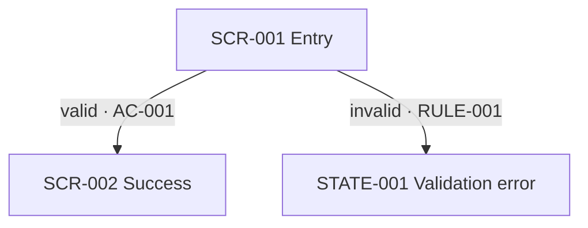

# User Flows

> Projection of `state.json`; update state first.

For each `FLOW-###`: actor, entry point, preconditions, trigger, happy path, alternatives, failures, recovery, exit, postcondition, related decisions/rules, screens, and acceptance IDs.

